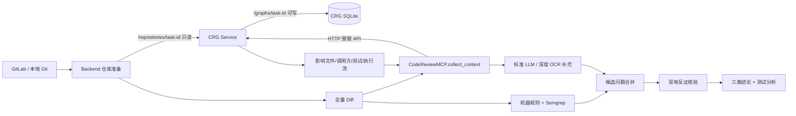
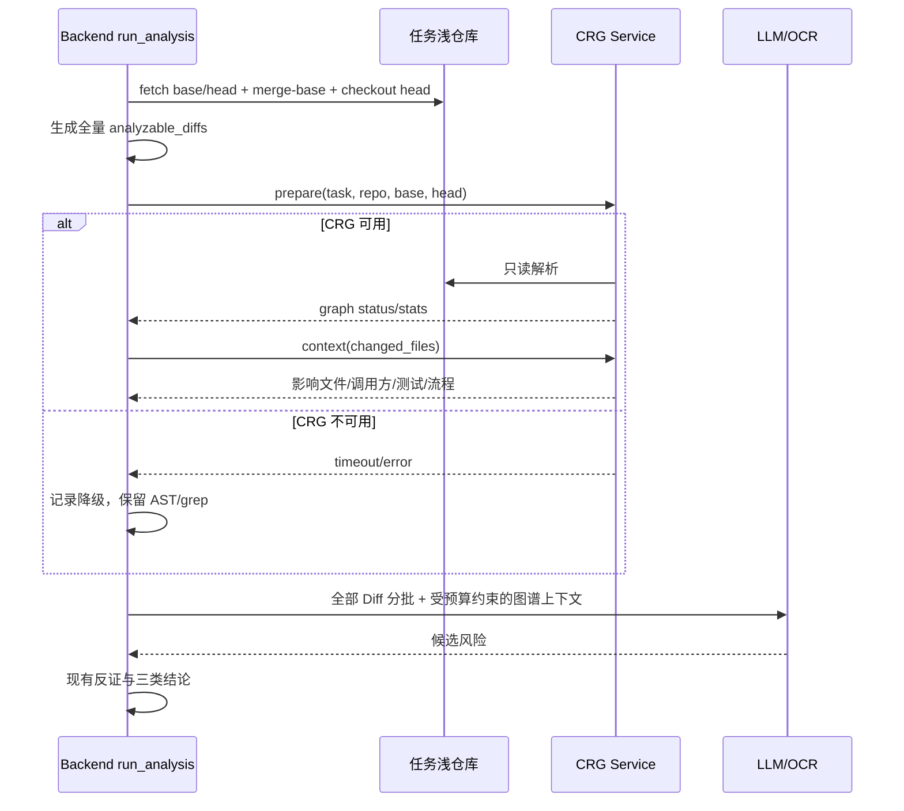

# 代码变更分析图谱增强技术设计

## 1. 设计结论

本期以 PoC 形式引入独立 `code-review-graph`（以下简称 CRG）容器，它只提供结构化代码上下文，不替换现有规则检查、Semgrep、OpenCodeReview、LLM 分析和反证链路。

推荐采用“独立容器 + 受限 HTTP API + 任务级图谱目录”，不让 Backend 安装 CRG，不让 Backend 直接读写 CRG SQLite，不向 CRG 传递 GitLab Token。

PoC 的核心成功条件不是“能生成图”，而是能够用真实 Java、Python、Vue 仓库证明：在保持全部 Diff 覆盖的前提下，图谱上下文能减少无效 Token，改善跨文件审查证据，且不恶化确定缺陷的误报与漏报。

## 2. 现状与改造边界

### 2.1 现有链路

`code_analysis.services.run_analysis()` 当前的主链路是：

1. 获取 MR 或两 Commit 的共同祖先 Diff。
2. 过滤配置排除文件和低价值文件。
3. 执行机器规则与 Semgrep。
4. 标准模式对全部可分析 Diff 分批调用 LLM；深度模式以 OpenCodeReview 为主、平台 LLM 补审失败文件。
5. 对候选问题读取目标 Commit 源码并执行跨文件反证。
6. 归类为确定缺陷、待确认风险、改进建议，再生成测试需求点。

`CodeReviewMCP.collect_context()` 当前使用 Tree-sitter 抽取变更文件声明，再按声明名称执行字面检索。CRG 只替换/补充这个“仓库结构上下文”层。

### 2.2 本期不做

- 不实施跨任务长期仓库缓存。
- 不启用 CRG 语义向量插件，避免引入 `sentence-transformers`/PyTorch 与额外模型。
- 不用 CRG 风险分直接生成缺陷结论。
- 不让 CRG 决定哪些 Diff 进入 LLM。

### 2.3 完整版追加范围

- 审查抽屉新增“影响分析”，展示变更符号、影响文件、调用方、已有测试、受影响流程和测试缺口。
- 每条风险显示核验状态、目标 Commit 核验、触发可达性、支持证据与反证/保护逻辑。
- 报告只持久化裁剪后的可解释预览，不落库原始源码片段或完整 CRG 响应。

## 3. 总体架构



### 3.1 组件职责

| 组件 | 职责 | 不承担的职责 |
|---|---|---|
| Backend | 准备授权仓库、获取 Diff、组织审查、记录报告 | 不直接操作 CRG SQLite |
| CRG Service | 构建/更新图谱、查询影响半径、调用方、测试和执行流 | 不获取 GitLab Token，不调用 LLM，不判定缺陷 |
| CodeReviewGraphClient | Backend 内部的超时、认证、错误映射与数据裁剪适配层 | 不掺入 prompt 生成 |
| CodeReviewMCP | 合并现有 AST/grep 上下文与 CRG 上下文 | 不改变 Diff 覆盖范围 |
| PoC Evaluator | 固定样本、采集 A/B 指标、生成对照报告 | 不写入生产审查结论 |

## 4. 容器与离线交付

### 4.1 新增组件

新增目录建议：

```text
WHartTest_CRG/
├── Dockerfile
├── requirements.txt
├── app.py
├── worker.py
└── tests/
```

- 基础镜像：优先 `python:3.11-alpine`，与当前内网 Alpine/musl 路线一致。
- CRG：锁定 `code-review-graph==2.3.9`，正式实施时再同时锁定上游 commit 和 wheel SHA256。
- API：FastAPI + Uvicorn，单 worker。PoC 期代码变更分析本身已全局串行，单 worker 可避免同一 SQLite 并发写。
- 运行用户：非 root，与 Backend 通过固定共享 GID 读取仓库。
- 容器中不安装本地 embedding 模型和浏览器。

### 4.2 离线包

构建流程必须：

1. 在有网环境下为 ARM64/AMD64 下载并锁定 Python wheels。
2. 镜像构建不访问 PyPI，仅从 wheelhouse 安装。
3. 在镜像内运行 `code-review-graph --version` 和小仓库构建冒烟。
4. 导出分片镜像、SHA256 和版本清单，纳入现有 `update_platform_version` 导入/验证流程。
5. 在真实麒麟 ARM64 64KB 页目标机执行冒烟，不仅依赖 Docker Desktop ARM64 模拟结果。

### 4.3 Compose 拓扑

```yaml
crg-service:
  image: wharttest-250-crg:<locked-version>-arm64
  volumes:
    - ./data/code-analysis-repositories:/repositories:ro
    - ./data/code-review-graphs:/graphs:rw
  environment:
    - CRG_REPOSITORY_ROOT=/repositories
    - CRG_GRAPH_ROOT=/graphs
    - CRG_INTERNAL_TOKEN=...
    - CRG_BUILD_TIMEOUT=600
    - CRG_QUERY_TIMEOUT=120
  networks:
    - wharttest-network
```

Backend 增加：

```text
CODE_REVIEW_GRAPH_URL=http://crg-service:8080
CODE_REVIEW_GRAPH_TOKEN=<shared-secret>
CODE_REVIEW_GRAPH_ENABLED=true
```

CRG 不暴露宿主机端口，仅在 `wharttest-network` 内可访问。

## 5. 目录、权限与标识

### 5.1 目录布局

```text
data/
├── code-analysis-repositories/
│   └── <task_uuid>/
│       ├── .git/
│       ├── .repository-id
│       └── <checked-out source>
└── code-review-graphs/
    └── <task_uuid>/
        ├── graph.db
        ├── metadata.json
        └── lock
```

### 5.2 权限

- Backend 创建任务仓库时使用共享组，目录为 `0750`。
- CRG 容器以非 root 用户加入该组，通过只读挂载读取仓库。
- CRG 图谱目录仅 CRG 运行用户可写。
- Backend 不挂载图谱目录；所有读取经 HTTP API。
- 不向 CRG 挂载整个 `/app/data`、Docker socket 或宿主机任意路径。

### 5.3 仓库身份校验

CRG 不接收任意绝对路径，只接收 `task_id`。服务端自行解析：

```text
repo_root  = safe_join(CRG_REPOSITORY_ROOT, task_id)
graph_root = safe_join(CRG_GRAPH_ROOT, task_id)
```

请求还必须携带 `repository_id` 和 `head_sha`。服务端校验：

- `task_id` 是标准 UUID；
- 解析后路径仍在允许根目录内；
- `.repository-id` 与 `repository_id` 一致；
- `git rev-parse HEAD` 与 `head_sha` 一致；
- 图谱 `metadata.json` 与仓库身份一致，不一致时重建而非复用。

## 6. CRG Service 内部 API

### 6.1 通用契约

- 认证：`Authorization: Bearer <internal-token>`。
- Content-Type：`application/json`。
- 请求大小上限：1 MiB。
- `changed_files` 最多 2,000 项，每项最长 1,000 字符，必须是相对路径。
- 同一 `task_id` 仅允许一个构建/更新进程。
- 统一返回 `request_id`、`crg_version`、`duration_ms`、`status`。
- 错误信息不包含源码、Token、宿主机路径和完整子进程命令。

### 6.2 `GET /health`

响应：

```json
{
  "status": "ok",
  "crg_version": "2.3.9",
  "writable_graph_root": true
}
```

### 6.3 `POST /v1/graphs/prepare`

用途：对已 checkout 到目标 Commit 的任务仓库构建或更新图谱。

请求：

```json
{
  "task_id": "uuid",
  "repository_id": 12,
  "base_sha": "40-64 hex",
  "head_sha": "40-64 hex",
  "force_rebuild": false
}
```

响应：

```json
{
  "status": "completed",
  "operation": "build",
  "graph_commit": "...",
  "parse_status": "complete",
  "failed_files": [],
  "stats": {"nodes": 0, "edges": 0, "files": 0},
  "duration_ms": 0,
  "request_id": "...",
  "crg_version": "2.3.9"
}
```

`parse_status` 可为 `complete|partial`。部分解析不使 HTTP 请求失败。

PoC 的生产接入中，每个审查任务拥有独立图谱，首次操作为 `build`；同一 head 重跑是 no-op 校验，不把它计为增量更新样本。真实的增量更新耗时由 PoC Evaluator 使用独立的 `benchmark/<case_id>` 运行槽测量：在同一仓库工作副本上先构建基线 Commit，再 checkout 目标 Commit 并调用增量更新。该运行槽只存在于实验数据目录，不被生产审查任务复用，因此不提前引入正式仓库级缓存。

### 6.4 `POST /v1/graphs/context`

请求：

```json
{
  "task_id": "uuid",
  "repository_id": 12,
  "base_sha": "...",
  "head_sha": "...",
  "changed_files": ["src/a.py", "tests/test_a.py"],
  "max_depth": 2,
  "limits": {
    "affected_files": 200,
    "callers": 100,
    "related_tests": 100,
    "affected_flows": 25,
    "source_lines": 800
  }
}
```

归一化响应：

```json
{
  "status": "completed",
  "graph_commit": "...",
  "changed_symbols": [],
  "affected_files": [],
  "callers": [],
  "related_tests": [],
  "affected_flows": [],
  "test_gaps": [],
  "source_snippets": [],
  "coverage": {
    "requested_changed_files": 2,
    "mapped_changed_files": 2,
    "unmapped_changed_files": [],
    "parse_status": "complete"
  },
  "truncation": {
    "truncated": false,
    "totals": {},
    "returned": {}
  },
  "context_savings": {},
  "duration_ms": 0,
  "request_id": "...",
  "crg_version": "2.3.9"
}
```

内部实现可组合 CRG 的 change detection、impact radius、review context 和 affected flows 能力，但该 HTTP 响应是 WHartTest 自己的稳定契约，不直接透传上游原始 JSON。

### 6.5 `POST /v1/graphs/cancel`

请求包含 `task_id`。CRG Service 终止该任务当前子进程，等待最多 10 秒，然后强制终止。中断的图谱不标记为可用；下次 `prepare` 执行完整性检查并必要时重建。

### 6.6 错误映射

| HTTP | code | Backend 处理 |
|---|---|---|
| 400 | `invalid_request` | 记录调用缺陷，本次降级 |
| 401/403 | `unauthorized` | 记录配置错误，本次降级 |
| 404 | `repository_not_ready` | 记录仓库未准备，本次降级 |
| 409 | `graph_busy` | 有界重试 1 次，仍失败则降级 |
| 422 | `identity_mismatch` | 不重试，本次降级并告警 |
| 499 | `cancelled` | 映射为 `AnalysisCancelled` |
| 504 | `timeout` | 取消 CRG 子进程并降级 |
| 500/503 | `internal_error/unavailable` | 不阻塞现有审查，记录降级 |

## 7. CRG 进程隔离实现

CRG 默认将 SQLite 写到仓库下的 `.code-review-graph/`，但本设计将仓库以只读方式挂载。因此每个 CRG 操作都在独立子进程中执行，为该进程设置：

```text
CRG_DATA_DIR=/graphs/<task_uuid>
```

不在长驻 API 进程内为不同请求动态修改全局环境变量，避免跨任务串数据。

`worker.py` 负责：

1. 从标准输入读取经校验的请求。
2. 在固定版本的 CRG Python API/CLI 上执行构建或查询。
3. 将上游结果归一化为 WHartTest API schema。
4. 向临时文件写完整 `metadata.json`，成功后原子替换。
5. 只向 stdout 输出一份 JSON，日志输出到 stderr。

API 进程保留 `task_id -> subprocess` 映射以支持取消。不使用 `shell=True`，不接受用户提供的命令行参数。

## 8. Backend 接入设计

### 8.1 新增适配层

新增 `WHartTest_Django/code_analysis/graph_client.py`：

```python
class CodeReviewGraphClient:
    def health(self): ...
    def prepare(self, task): ...
    def collect_context(self, task, changed_files): ...
    def cancel(self, task_id): ...
```

适配层负责：

- 从受信任的 `AnalysisTask` 生成请求，不接受前端路径。
- 统一连接/读取超时、有界重试、认证头和响应 schema 校验。
- 对数组长度、源码片段和总 JSON 字符数进行二次裁剪。
- 将异常归一化为 `GraphUnavailable`、`GraphTimeout`、`GraphCancelled`、`GraphProtocolError`。

### 8.2 `collect_context()` 结构

保留当前 `items` 结构，新增 `graph_context`：

```json
{
  "parser": "tree-sitter",
  "items": [],
  "graph_context": {
    "status": "completed|partial|unavailable|skipped",
    "graph_commit": "...",
    "changed_symbols": [],
    "affected_files": [],
    "callers": [],
    "related_tests": [],
    "affected_flows": [],
    "test_gaps": [],
    "source_snippets": [],
    "coverage": {},
    "truncation": {},
    "context_savings": {},
    "diagnostics": {
      "prepare_ms": 0,
      "query_ms": 0,
      "crg_version": "2.3.9",
      "degraded_reason": ""
    }
  }
}
```

降级时仍返回当前 AST/grep `items`，`graph_context.status=unavailable`。

### 8.3 审查时序



### 8.4 接入点

1. `_managed_gitlab_repository()` 保证浅仓库 checkout 到 `head_sha`，并将目录设为共享组可读。
2. `run_analysis()` 在生成 `analyzable_diffs` 后触发 CRG prepare/context，但不更改 `analyzable_diffs`。
3. `_run_ai_batches()` 通过 `CodeReviewMCP.collect_context()` 获取图谱增强数据。
4. `_verify_findings_against_target()` 可用图谱调用方和影响路径作为反证索引，但 PoC 第一轮可先只用于候选审查上下文，避免同时改动两个变量。
5. `_stop_analysis_task()` 在终止 OCR/Celery 前后调用 CRG cancel；CRG cancel 失败不得阻塞主任务取消。
6. `remove_ocr_repository()` 与仓库删除流程增加图谱目录清理。

### 8.5 上下文预算

必须保持以下顺序：

1. 当前批次的全部 Diff（不可被 CRG 替换）。
2. 已确认的机器规则/Semgrep 证据。
3. 变更符号所在函数/类的图谱片段。
4. 直接调用方与关联测试。
5. 间接影响文件与执行流概要。
6. 现有 grep 相关行作为图谱未覆盖时的补充。

同一文件/符号在 AST、grep 和 CRG 间去重。超出预算时只裁剪第 4–6 级的补充数据，不裁剪第 1 级 Diff 覆盖。

## 9. 报告数据与可观测性

### 9.1 PoC 期数据存储

PoC 期不新建 Django 图谱业务表，避免过早固化长期缓存模型。

- 可展示的图谱摘要写入 `AnalysisTask.change_report.graph_context`。
- 阶段事件、耗时、图谱版本、节点/边数、截断和降级原因写入 `AnalysisTaskExecutionLog.detail`。
- 完整 CRG 原始响应不写入数据库，避免报告膨胀与绝对路径泄露。
- 原始图谱 SQLite 仅留在 CRG 持久目录。

### 9.2 执行日志事件

建议事件：

- `graph_prepare_started`
- `graph_prepare_finished`
- `graph_context_finished`
- `graph_degraded`
- `graph_cancelled`

`detail` 至少包含：

```json
{
  "stage": "graph_context",
  "request_id": "...",
  "crg_version": "2.3.9",
  "graph_commit": "...",
  "parse_status": "complete",
  "duration_ms": 0,
  "node_count": 0,
  "edge_count": 0,
  "mapped_changed_files": 0,
  "unmapped_changed_files": 0,
  "truncated": false,
  "degraded_reason": ""
}
```

实施前需要同步扩展 `AnalysisTaskExecutionLog.EVENT_CHOICES`，避免代码中使用模型未声明的事件值。

## 10. 降级、超时与取消

### 10.1 降级原则

CRG 的任何失败都是“上下文增强降级”，不是代码变更分析任务失败，除非用户取消了整个任务。

| 场景 | 处理 |
|---|---|
| CRG 未配置/未启用 | `graph_context.status=skipped`，走现有链路 |
| 健康检查失败 | 不反复探测，本任务降级 |
| 构建超时 | 取消子进程，降级 |
| 部分解析 | 使用已覆盖结果，明示未覆盖文件 |
| 查询截断 | 使用已返回结果，保留 totals/returned |
| 查询超时/格式错误 | 使用当前 AST/grep 上下文 |
| 图谱 Commit 不匹配 | 不使用旧图，本任务降级并记录告警 |

### 10.2 超时预算

PoC 初始值：

- 首次构建：600 秒。
- 增量更新：180 秒。
- 上下文查询：120 秒。
- Backend HTTP 超时比 CRG 内部超时多 10 秒，用于收集可诊断的错误响应。

这些是上限而不是 PoC 性能目标；最终阈值以真实仓库测量结果调整。

## 11. PoC A/B 评估设计

### 11.1 对照原则

- A 组：当前平台逻辑，CRG 关闭。
- B 组：只开启 CRG 上下文，其他配置与 A 组相同。
- 同一仓库、同一 base/head、同一 LLM 配置、同一 prompt 版本、同一 Semgrep/OCR 版本。
- LLM temperature 保持当前值；重复运行至少 3 次时，报告中位数和离散程度。
- 人工评审人员不看 A/B 标识，避免主观偏置。

### 11.2 样本

Java、Python、Vue 每种至少：

- 10 个已知最终结论的变更集；
- 覆盖小型（1–2 文件）、中型（3–10 文件）、大型（10+ 文件）；
- 至少 3 个跨模块/跨层调用变更；
- 至少 2 个已知有相关测试的变更；
- 至少 2 个人工确认无缺陷的负样本。

### 11.3 金标

每个变更集建立脱离 A/B 输出的人工金标：

- 真实缺陷清单；
- 不是缺陷但需确认的风险；
- 影响文件与调用链；
- 应回归测试；
- 证据文件/行号和人工裁决说明。

至少两名评审人独立标注，分歧经复核后形成最终金标。

### 11.4 指标定义

| 指标 | 定义 |
|---|---|
| Token 消耗 | 任务所有 LLM 调用的 input/output/total tokens，同时报告每变更文件 Token |
| 审查耗时 | 任务端到端耗时，另拆分仓库准备、图谱构建、图谱查询、规则、LLM/OCR、反证耗时 |
| 确定缺陷采纳率 | 人工确认的 `confirmed` 数 ÷ 平台输出的 `confirmed` 数 |
| 误报率 | 人工判定为错误的有效交付问题数 ÷ 交付问题总数 |
| 漏报率 | 金标真实缺陷中未被平台命中的数量 ÷ 金标真实缺陷总数 |
| 影响召回率 | 金标影响文件中被 CRG 返回的数量 ÷ 金标影响文件总数 |
| 首次构建时间 | 从 CRG prepare 接收请求到图谱可查询 |
| 增量更新时间 | 从新 head checkout 完成到新图谱可查询 |

采纳率不能单独作为通过依据；如果通过少报问题提高采纳率，但漏报率恶化，PoC 不通过。

### 11.5 建议通过门槛

PoC 同时满足以下条件才建议进入长期缓存/前端展示阶段：

1. 所有可分析 Diff 文件覆盖率保持 100%。
2. 确定缺陷漏报率不高于 A 组；误报率不高于 A 组 2 个百分点。
3. 确定缺陷采纳率不低于 A 组。
4. 跨文件样本的影响文件召回率至少 80%，并高于现有 grep 方式。
5. LLM 非 Diff 上下文 Token 中位数下降至少 30%；若未下降，必须证明缺陷/影响召回的提升足以覆盖成本。
6. CRG 故障注入时，100% 任务能按原链路结束为完成或降级完成。
7. 目标硬件上的构建/查询时间不超过配置上限，且无孤儿进程、损坏图谱被误用或跨任务串数据。

## 12. 测试策略

### 12.1 CRG Service

- 路径穿越、非 UUID、仓库标识不匹配、Commit 不匹配。
- 未认证、错误 Token、超大请求和超长文件列表。
- Python/Java/TypeScript/Vue 小仓库构建与查询。
- `complete`、`partial`、截断、空影响面和未映射文件。
- 同一任务并发 prepare 锁、超时和 cancel。
- 中断构建后再次 prepare 不读取不完整图谱。
- 响应中不出现绝对路径、密钥和完整源码文件。

### 12.2 Backend

- `CodeReviewGraphClient` 正常、超时、400/401/409/422/500/504 映射。
- `collect_context()` 正常、部分、不可用和超限响应。
- 无论 CRG 是否成功，`analyzable_diffs` 文件数和分批数都不减少。
- CRG 数据只影响 prompt 上下文，不能直接创建 `confirmed` finding。
- 取消任务会调用 CRG cancel，但 CRG cancel 失败不阻塞本地取消。
- 仓库/任务删除时图谱清理范围受 UUID 根目录限制。
- 历史报告不依赖图谱目录仍可回看。

### 12.3 部署与目标机

- AMD64 本地与 ARM64 离线镜像健康检查。
- 麒麟 ARM64 64KB 页环境构建 Python/Java/Vue 仓库图谱。
- CRG 容器无外网情况下完整运行。
- 只读仓库挂载不产生 `.code-review-graph` 写入。
- 重启 CRG 容器后任务图谱数据仍存在。

## 13. 发布、开关与回滚

### 13.1 开关

- 全局：`CODE_REVIEW_GRAPH_ENABLED=false` 默认关闭。
- PoC 运行时显式开启，不改变既有用户的默认行为。
- 不在前端向普通用户暴露该开关，防止实验组不可控。

### 13.2 发布顺序

1. 交付并验证 CRG 独立镜像，但保持 Backend 开关关闭。
2. 上线 Compose 服务、挂载与健康检查。
3. 上线 Backend 适配层和降级逻辑。
4. 执行故障注入，确认 CRG 停服不影响当前审查。
5. 仅在 PoC 环境打开开关并开始 A/B 数据采集。

### 13.3 回滚

- 首选回滚：关闭 `CODE_REVIEW_GRAPH_ENABLED`，Backend 立即回到当前审查路径。
- 容器回滚：停止 CRG Service 并恢复 Compose；不需改动 Backend 主镜像依赖。
- 数据回滚：图谱目录是派生数据，可在确认范围后单独清理；历史报告不受影响。

## 14. 实施分界

本设计通过后，下一阶段生成 `tasks.md`，并按以下主线拆分为可验收任务：

1. CRG 独立服务与离线镜像。
2. Compose 挂载、权限、密钥与健康检查。
3. Backend CRG client 与 `collect_context()` 接入。
4. 取消、删除、降级、日志与报告数据。
5. 单元/集成/目标机验证。
6. Java/Python/Vue A/B PoC 评估工具和结果报告。

## 15. 待确认的设计点

1. PoC 是否按本设计仅在“标准模式”先接入，第一轮不改动深度 OCR 链路（推荐）。
2. CRG 内部服务共享 Token 是否沿用现有部署包的密钥生成/恢复机制（推荐）。
3. A/B PoC 的三个真实仓库、变更集和两名人工评审人由哪一方提供。

## 16. 参考

- CRG 版本：2.3.9（PoC 设计基线）。
- 上游许可：MIT，交付镜像和第三方声明必须保留许可文本。
- CRG 上游能力使用：Tree-sitter 结构解析、SQLite 本地图、增量更新、change detection、impact radius、review context、affected flows 和 test gaps。
