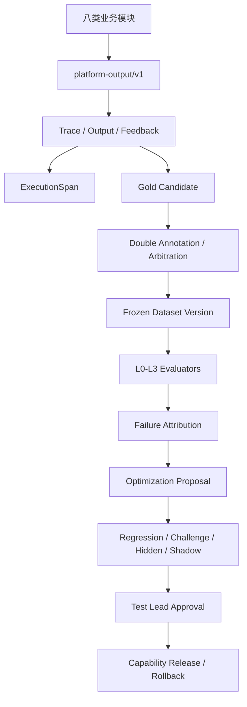

# IQH质量飞轮、测评与受控自进化V2 - 技术设计

## 架构

## 金标模型

- `GoldDataset`：项目级金标资产。
- `GoldDatasetVersion`：草稿、标注、复核、冻结和退役版本。
- `GoldCase`：来源、哈希、期望、量表、证据、分区、隐私和优化许可。
- `GoldAnnotation`：初标、复核和仲裁结果。
- `AnnotationConflict`：标注分歧和负责人裁决。

冻结版本通过有序样本快照生成SHA-256，冻结后只能退役，修改必须创建后继版本。

## 分层测评

- `EvaluationRubric`：能力量表、必须项、禁止项和陪审团配置。
- `JudgeResult`：保存每个确定性或LLM裁判的独立证据。
- `LayeredEvaluationService`：聚合L0-L3并写入现有`EvaluationResult`。
- `EvaluationRun`扩展金标版本、能力版本和重放哈希。

首批评测器：Schema、隐私、量表规则、陪审团、真实反馈、五阶段业务结果。

## 轨迹与归因

- `ExecutionSpan`使用父子邻接关系记录节点轨迹。
- `FailureAttribution`保存类别、来源、置信度、证据、反证和确认状态。
- 确定性错误优先归因；LLM辅助归因不得直接成为事实。

## 受控优化

- `OptimizationProposal`：四类候选及结构化差异、风险、收益和回滚策略。
- `OptimizationExperiment`：绑定冻结金标、基线/候选运行、能力版本、门禁和影子结果。
- 已确认归因才能生成候选。
- 生成候选不等于发布，生产变更继续走`CapabilityRelease`审批。

## 权限

- 现有`member`映射测试执行人员。
- 现有`admin/owner`映射测试负责人。
- 所有查询按项目成员过滤；冻结、仲裁、量表配置和发布仅负责人执行。

## 安全

- 协议元数据只保存正文哈希和引用，不复制原始Diff或敏感文档。
- 金标候选输入快照保存对象ID和哈希。
- `prohibited`样本禁止进入优化上下文。
- 隐藏集由独立执行路径评测。

## API分组

- `/gold-datasets`、`/gold-dataset-versions`、`/gold-cases`、`/gold-annotations`。
- `/evaluation-rubrics`、`/judge-results`。
- `/execution-spans`、`/failure-attributions`。
- `/optimization-proposals`、`/optimization-experiments`。
- 继续复用现有`capability-releases`晋级和回滚API。

## 发布策略

1. 模型与只读接口。
2. 影子轨迹采集。
3. 金标和离线评测。
4. 人工确认归因。
5. 候选生成与分级验证。
6. 人工审批后灰度。
