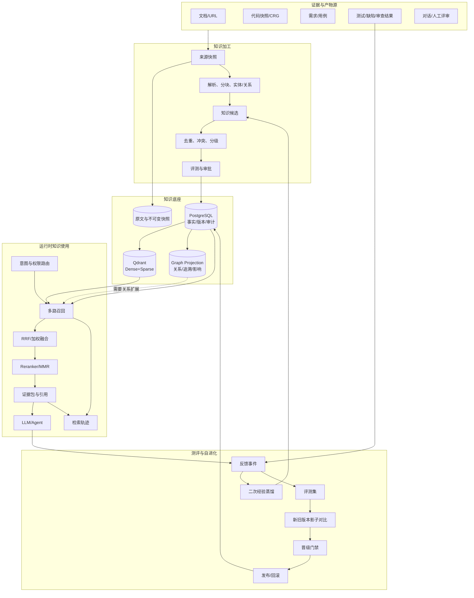
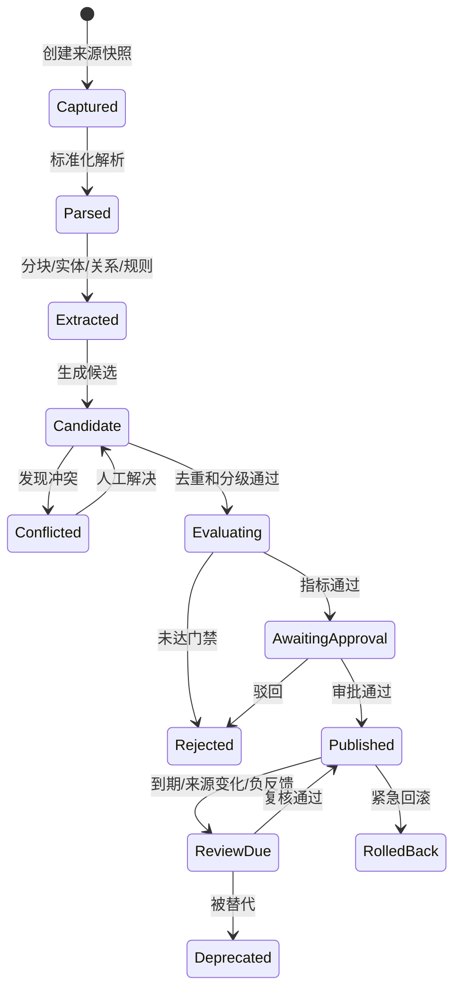
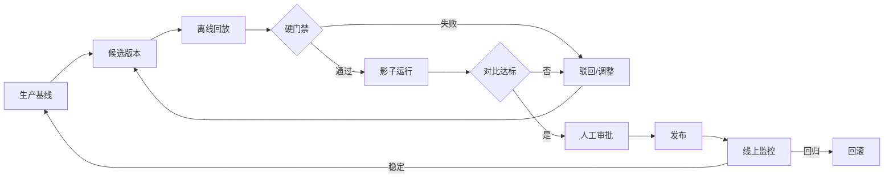

# 知识数据飞轮、测评与自进化完整设计

## 1. 设计原则

1. **证据与推理分离**：原始证据不可被摘要、图节点或 LLM 结论覆盖。
2. **事实与索引分离**：PostgreSQL 是事实账本，Qdrant 和图谱是可重建投影。
3. **候选与生产分离**：自动化只能生成候选，不能越过晋级门禁。
4. **反馈可归因**：没有任务、输出、轨迹和版本四级关联的反馈，不进入训练/评测数据。
5. **客观信号优先**：测试结果、缺陷关闭、合并/回退高于单次点赞。
6. **先影子后晋级**：任何检索、Prompt、Skill 或 Agent 变更先对比，再生效。
7. **图谱按需使用**：图谱解决关系和追溯，不为普通直接命中增加无意义延迟。

## 2. 总体架构



## 3. 模块边界与现有系统落位

| 边界 | 职责 | 现有基础 | 改造方式 |
|---|---|---|---|
| `knowledge` | 文档、分块、向量化、基础检索 | `Document`/`DocumentChunk`/Qdrant/RRF/Reranker | 增加快照、版本、有效性，拆分检索编排 |
| `knowledge_graph` | 统一 GraphSource 和派生图投影 | 代码 CRG 与图谱工作台 | 新增文档适配器，不把文档图塞进 CRG |
| `knowledge_evolution` | 候选、反馈、评测、晋级、回滚 | 尚无独立边界 | 新 Django app，避免继续膨胀 `knowledge/services.py` |
| `task_center`/Celery | 增量建索、评测、防腐、回放 | Celery + django-celery-beat | 增加幂等任务和任务轨迹 |
| 业务模块 | 生成任务产物与客观反馈 | 代码审查、测试任务、用例、需求 | 只发送标准化事件，不直接写知识资产 |

## 4. 存储架构

### 4.1 PostgreSQL：唯一事实来源

| 实体 | 关键字段 | 用途 |
|---|---|---|
| `SourceSnapshot` | `source_type/source_id/revision/content_hash/acl/status` | 不可变来源快照 |
| `KnowledgeAsset` | `project/type/key/title/level/owner/status/current_version` | 稳定业务标识 |
| `KnowledgeVersion` | `asset/version/content/source_snapshot/valid_from/expires_at` | 不可变发布版本 |
| `KnowledgeEvidence` | `version/snapshot/location/relation/weight` | 资产与证据关联 |
| `KnowledgeCandidate` | `kind/payload/source/evidence/confidence/state/dedup_key` | 自动提炼的待审候选 |
| `KnowledgeConflict` | `left/right/type/state/resolution` | 矛盾、时效或适用域冲突 |
| `IndexProjection` | `version/index_type/projection_version/checksum/state` | Qdrant/图谱投影一致性 |
| `RetrievalTrace` | `query/context/policy/candidates/citations/tokens/latency` | 可解释检索轨迹 |
| `GenerationOutput` | `task/trace/model/prompt_version/output_hash/content` | 将反馈绑定到精确输出 |
| `FeedbackEvent` | `output/trace/version/signal/value/reason/outcome/actor` | 主观和客观反馈 |
| `EvaluationSuite` | `scope/version/composition/status` | 评测集版本 |
| `EvaluationCase` | `input/expected/evidence/split/source_fingerprint` | 去泄漏样本 |
| `EvaluationRun` | `candidate/baseline/dataset/metrics/artifacts/state` | 新旧版本对比 |
| `CapabilityRelease` | `kind/version/config/state/previous_release` | 检索/Prompt/Skill/Agent 发布单元 |
| `PromotionDecision` | `run/decision/gates/approvers/reason` | 晋级审计 |

所有业务实体均带 `project_id` 或可追溯项目边界；不使用全局评测样本绕过项目 ACL。

### 4.2 Qdrant：可重建候选索引

- 建议从“每知识库一个 collection”过渡为版本化 collection alias：`kb_<id>_v<projection>` + `kb_<id>_active`。
- payload 必须包含 `project_id/knowledge_base_id/asset_id/version_id/snapshot_id/level/status/acl_tags/content_hash`。
- 新索引先写入新 collection，校验数量和召回后原子切换 alias；回滚只切 alias。
- 删除用逻辑状态先隔离，物理回收由延迟任务处理。

### 4.3 图谱：关系投影

#### 节点类型

`Document` 、`Section`、`Chunk`、`Concept`、`Rule`、`Requirement`、`TestCase`、`TestRun`、`Defect`、`Repository`、`File`、`Symbol`、`KnowledgeAsset`、`Evidence`、`Feedback`。

#### 关系类型

- 结构：`CONTAINS`、`PART_OF`、`NEXT`。
- 语义：`MENTIONS`、`DEFINES`、`REFINES`、`CONTRADICTS`、`SUPERSEDES`。
- 研测：`IMPLEMENTS`、`VERIFIES`、`FAILED_BY`、`FOUND`、`IMPACTS`。
- 证据：`SUPPORTED_BY`、`DERIVED_FROM`、`ACCEPTED_BY`、`REFUTED_BY`。
- 代码：复用 CRG 的 `CALLS`、`IMPORTS_FROM`、`INHERITS`等，通过联邦适配器查询，不直接混写 CRG SQLite。

文档图谱使用与已实现的 `GraphSource → Snapshot → Node/Edge/Evidence` 同一协议，源 ID 为 `document:<snapshot_uuid>` 或 `knowledge-base:<projection_uuid>`。

## 5. 知识加工流程



### 5.1 标准化接收

- 文档：保留原文、解析文本、页码/标题层级/表格位置。
- 代码：保留 repo + commit + file + line，通过 CRG 适配器建图。
- 任务结果：保留任务、执行、配置、模型和时间窗口。
- 快照幂等键：`source_type + source_id + revision + content_hash`。

### 5.2 结构提取

1. 规则性分块：优先按标题、段落、表格、代码块，再用 token 上限补切。
2. 实体标准化：别名、缩写、项目词表和代码符号映射到稳定 key。
3. 关系提取：规则优先，LLM 补充；每条关系必须带证据位置、提取器版本和信心。
4. 知识原子：将“对象 + 约束/行为 + 条件 + 适用域 + 证据”作为最小可治理单元。

### 5.3 分级与有效期

| 等级 | 语义 | 生产行为 | 默认复核 |
|---|---|---|---|
| L1 强制 | 安全、合规、硬性规范 | 强制注入、强校验；专家+管理员双审 | 来源变更立即，否则 90 天 |
| L2 应当参考 | 最佳实践、故障案例、审查准则 | 高权重检索，可由人工覆盖 | 180 天 |
| L3 可选参考 | 行业案例、启发式经验 | 普通候选，不影响强约束 | 90 天 |

## 6. 运行时检索架构

### 6.1 检索路由

`RetrievalRequest` 包含：`project_id` 、`principal` 、`task_type` 、`query` 、`selected_sources` 、`required_levels` 、`time_budget` 、`token_budget` 、`graph_policy`。

图谱路由规则：

- `always`：代码影响、需求覆盖、缺陷根因、来源追溯。
- `conditional`：直接召回信心不足、需要多跳、存在冲突或跨类型关联。
- `never`：精确 ID/标题查询、已有 L1 直接命中、超出延迟预算。

### 6.2 候选融合

1. Dense 召回 `k=40`、Sparse 召回 `k=40`、图谱返回最多 80 节点/160 边。
2. 先在通道内去重，再用 weighted RRF 融合：Dense 0.35、Sparse 0.30、Graph 0.20、结构化/历史高质量 0.15。权重由版本化策略管理，不硬编码。
3. Reranker 精排 Top 30，MMR 压制近重复，最终证据包默认 8–12 条。
4. 上下文装配顺序：L1 必须知识 → 直接证据 → 图扩展证据 → 反例/冲突 → L2/L3 参考。
5. 每条证据都带 `citation_id/version/source/location/freshness/access_scope`，LLM 结论使用 citation ID。

### 6.3 反证与冲突

- 对代码审查和高风险决策，主召回后专门执行反证查询：寻找已有防护、同步修改、替代流程、通过测试和新版本规范。
- 冲突证据不静默丢弃，与支持证据一起交给裁决器，输出 `confirmed/needs_confirmation/refuted/inconclusive`。
- 当存在未解决 L1 冲突时，禁止自动执行，降级为人工确认。

## 7. 反馈和数据飞轮

### 7.1 标准反馈事件

```json
{
  "event_id": "uuid",
  "project_id": 1,
  "task_type": "code_review",
  "task_id": "uuid",
  "output_id": "uuid",
  "retrieval_trace_id": "uuid",
  "knowledge_version_ids": ["uuid"],
  "signal": "accepted|rejected|edited|test_passed|test_failed|defect_confirmed|false_positive|missed|merged|reverted",
  "value": 1,
  "reason_code": "evidence_wrong",
  "comment": "optional",
  "actor_type": "user|system|integration",
  "occurred_at": "ISO-8601"
}
```

### 7.2 信号权重和防污染

| 信号 | 建议权重 | 备注 |
|---|---:|---|
| 人工确认缺陷/漏报 | 1.0 | 需要具体证据 |
| 测试失败/通过且可归因 | 0.9 | 排除环境失败 |
| 代码回退/修复提交 | 0.9 | 需关联任务 |
| 专家采纳/驳回 | 0.8 | 保存理由 |
| 普通用户编辑 | 0.5 | diff 比点赞更有价值 |
| 单次点赞/点踩 | 0.2 | 不单独生成候选 |

事件去重键为 `task + output_hash + signal + actor/outcome`。反馈需按项目、用户、时间和任务分层，避免单一用户或重复自动化任务刷高置信度。

### 7.3 二次经验蒸馏

1. 以“任务类型 + 知识对象 + 结果”分组。
2. 要求至少 3 个去重任务或 2 个独立客观信号；否则只作观察样本。
3. 提取“触发条件—行动—预期结果—反例—证据”。
4. 与现有资产近重复/冲突检测，然后进入 `KnowledgeCandidate`。
5. 不将用户对话原文默认升级为共享知识；需先脱敏、授权和去个人化。

## 8. 测评体系

### 8.1 评测集组成

- **Gold 20%**：专家标注、长期固定，仅在发现标注错误时修改。
- **Regression 50%**：来自历史任务的已确认结果与反例。
- **Fresh 20%**：最近时间窗口新数据，用于发现漂移。
- **Challenge 10%**：冲突、边界、权限、注入攻击、无答案和高相似误导样本。

当前无金标时，首先建立 50–100 条“种子集”，由现有已采纳/驳回记录和人工复核构成；不用 LLM 自己生成标准答案后再自评。

### 8.2 四层测评

| 层级 | 对象 | 核心指标 |
|---|---|---|
| L0 数据/索引 | 快照、分块、向量、图谱 | 解析成功率、投影一致率、孤儿率、过期率 |
| L1 检索 | 候选与排序 | Recall@k、Precision@k、MRR、nDCG、去重率、权限泄漏率 |
| L2 生成 | 回答/报告/建议 | 引用正确率、证据支持率、完整性、反证命中率、格式合规 |
| L3 任务 | 真实业务结果 | 确定缺陷采纳率、漏报率、误报率、用例采纳率、任务成功率 |

横切指标：P50/P95 延迟、Token/单次有效结果、建索耗时、增量更新耗时、人工复核分钟数。

### 8.3 关键指标口径

- `Evidence Support Rate = 有可验证引用的关键结论 / 全部关键结论`。
- `Citation Correctness = 真正支持对应结论的引用 / 全部引用`。
- `Knowledge Utility = 被最终结论使用且任务成功的版本次数 / 该版本被召回次数`。
- `False Positive Rate = 确认误报 / 被交付的风险数`。
- `Miss Rate = 事后确认但当时未报告的问题 / 全部确认问题`。
- `Effective Result Cost = (模型 + 检索 + 建索成本) / 被采纳的有效结果数`。

### 8.4 自动评分边界

- 可确定性自动评分：JSON schema、引用存在、ACL、哈希、延迟、Token、检索命中、测试结果。
- LLM Judge 只用于语义完整性和开放问题，且必须版本化 judge prompt/模型，定期与人工校准。
- LLM Judge 不得单独裁定安全、权限、L1 知识和金标正确性。

## 9. 自进化 LOOP



### 9.1 可进化对象

| 类型 | 候选来源 | 发布单元 |
|---|---|---|
| 知识 | 文档变更、经验蒸馏、冲突解决 | `KnowledgeVersion` |
| 检索策略 | 失败查询聚类、权重/阈值搜索 | `RetrievalPolicyVersion` |
| Prompt | 驳回原因和结果 diff | `PromptVersion` |
| Skill | 稳定多步操作模式 | `SkillVersion` |
| Agent 配置 | 路由、工具、模型和预算对比 | `AgentRelease` |

基础模型微调不列入首期闭环。如未来开启，必须使用独立的已授权、去敏、去泄漏训练集和独立发布门禁。

### 9.2 晋级门禁

#### 硬门禁（任一失败即禁止发布）

- 越权泄漏率 = 0。
- L1 规则违反 = 0。
- 引用指向无效或不存在 = 0。
- 固定 Gold 上重大回归 = 0。
- 模式/输出契约通过率 = 100%。

#### 软门禁（建议初始值）

- 主指标相对基线提升 ≥ 3%，或不下降且成本/延迟改善 ≥ 10%。
- 关键切片的 Recall@10 不得下降超过 1 个百分点。
- Citation Correctness ≥ 95%，Evidence Support Rate ≥ 90%。
- P95 延迟不超预算，Token 增幅不超 15%；超过时必须有显著质量收益并手工批准。
- 至少包含 30 个独立任务的影子样本；高风险发布至少 100 个。

### 9.3 影子运行

同一输入同时运行 baseline 和 candidate，但仅 baseline 结果对用户可见。保存候选的候选集、引用、输出、耗时和 Token，并将客观后续结果同时回填到两个版本。首期不做对用户可见的自动分流。

### 9.4 发布与回滚

- 发布对象是不可变 `CapabilityRelease`，包含策略、Prompt、Skill、Agent 和知识投影版本的组合。
- 发布使用项目级 alias/激活指针，不就地改写历史配置。
- 自动回滚触发：权限事件 >0、L1 违反 >0、P95 超预算 50% 持续 15 分钟、确认误报率超基线 5 个百分点。
- 人工可从发布记录一键回滚，回滚本身产生审计事件。

## 10. 防腐化和一致性机制

| 频率 | 任务 | 异常处置 |
|---|---|---|
| 实时 | 来源 hash、投影写入结果、ACL 校验 | 失败即不切换 active alias |
| 每日 | 过期知识、失效引用、未完成任务、孤立图节点 | 标记待复核/重试 |
| 每周 | PG/Qdrant/图谱数量与 checksum 对账、质量漂移 | 增量修复或纳入重建队列 |
| 每月 | 全量评测、索引健康、低价值资产 | 产生治理报告，不自动删除 |
| 不兼容升级 | 新建投影→回放→checksum→alias 切换 | 保留旧投影供回滚 |

引入 Outbox 事件模式：知识版本与 `ProjectionRequested` 在同一 PostgreSQL 事务中提交，Celery 幂等消费后更新 `IndexProjection`，避免数据库已发布而向量/图谱没有更新。

## 11. API 设计

### 知识治理

- `GET/POST /api/knowledge-assets/`
- `GET /api/knowledge-assets/{id}/versions/`
- `POST /api/knowledge-candidates/{id}/evaluate/`
- `POST /api/knowledge-candidates/{id}/approve|reject|merge/`
- `GET/POST /api/knowledge-conflicts/`
- `POST /api/knowledge-releases/{id}/rollback/`

### 检索与反馈

- `POST /api/knowledge-retrieval/search/`：返回证据包和 `trace_id`。
- `GET /api/knowledge-retrieval/traces/{id}/`：查看各阶段候选与引用。
- `POST /api/knowledge-feedback/`：写入标准反馈事件。
- `POST /api/knowledge-feedback/outcomes/`：测试/缺陷/合并系统回填客观结果。

### 测评与发布

- `GET/POST /api/evaluation-suites/`
- `POST /api/evaluation-runs/`
- `GET /api/evaluation-runs/{id}/comparison/`
- `POST /api/capability-releases/{id}/shadow/`
- `POST /api/capability-releases/{id}/promote/`
- `POST /api/capability-releases/{id}/rollback/`

### 图谱协议扩展

将现有 `/api/code-analysis/graph-sources/` 上移为中性 `/api/knowledge-graph/sources/`；保留旧路由兼容一个版本。适配器注册：`code_repository`、`knowledge_document`、`requirement`、`test_case`、`defect`。

## 12. 界面方案

1. **知识源**：文档/仓库/需求/测试数据源，处理状态、快照和重建。
2. **知识资产**：L1/L2/L3、版本、证据、有效期、待复核和冲突。
3. **图谱工作台**：切换代码/文档/联合图，从节点查看原文、版本、冲突和使用记录。
4. **检索观测**：查询轨迹、Dense/Sparse/Graph 候选、排名变化、引用和 Token。
5. **反馈中心**：采纳/驳回/编辑 diff、缺陷/测试客观信号、待归因事件。
6. **测评与发布**：新旧对比、切片指标、门禁、影子运行、审批和回滚。
7. **飞轮看板**：从数据量转向有效知识率、任务收益、人工成本和腐化风险。

## 13. 权限和安全

- 在召回前过滤 ACL，不在返回后修剪；图谱扩展每一跳都继承权限交集。
- 评测样本存储权限快照或脱敏内容；评测运行不得提升操作者权限。
- Prompt 注入内容作为数据，不得改写系统指令或工具权限。
- 反馈中的对话、代码和个人信息在蒸馏前先脱敏；记录脱敏规则版本。
- 发布、回滚、L1 审批和冲突裁决使用独立权限，并写入不可篡改审计记录。

## 14. 可观测性与 SLO

### 首期 SLO

- 检索 API P95 ≤ 2.5s；启用图扩展 P95 ≤ 4s。
- 检索轨迹写入成功率 ≥ 99.9%；写入失败不阻断主任务，但该输出不进入飞轮。
- 投影一致率 ≥ 99.5%；不一致的资产不作为 L1 使用。
- 增量文档投影 P95 ≤ 5 分钟；大型仓库依照 CRG 实测基线单独设置。
- 生产版本回滚控制面操作 ≤ 1 分钟，不要求同步物理删除新索引。

主要 telemetry：`trace_id/release_id/source_snapshot_ids/channel_counts/graph_hops/rerank_count/citation_count/token_usage/latency/outcome`。默认不将原始敏感内容写入指标标签。

## 15. 测试策略

- 模型单测：状态机、幂等键、去重、分级、有效期、冲突和门禁。
- 合同测试：GraphSource 适配器、检索通道、Feedback Event 和 Evaluation Runner。
- 一致性测试：PG—Qdrant—Graph 数量/checksum、alias 切换和回滚。
- 安全测试：跨项目、丢失 ACL、图跨边界、Prompt 注入和评测集泄漏。
- 回放测试：Java/Python/Vue 真实仓库，文档问答、需求生成用例、代码审查和故障根因。
- 故障演练：Qdrant/图谱/LLM 不可用、Celery 重试、重复事件、半成投影和中途回滚。

## 16. 分阶段建设

### Phase 0：可观测基线（1–2 周）

- 统一 `RetrievalTrace` 和 `GenerationOutput`，不改变现有检索结果。
- 接入代码审查和知识库查询的 Token/耗时/引用/后续结果。
- 从现有历史记录人工复核 50–100 条种子评测集。

### Phase 1：知识资产化与文档图谱（3–5 周）

- 快照、资产、版本、证据、候选、冲突和投影表。
- 结构分块、文档实体/关系提取、`knowledge_document` GraphSource 适配器。
- Qdrant 版本化 collection/alias 和增量重建。

### Phase 2：反馈与测评闭环（3–4 周）

- 标准 Feedback Event，接入代码审查结果、用例采纳、测试成败和缺陷状态。
- Evaluation Suite/Run、指标计算、基线对比和切片分析。
- 飞轮看板、失败查询和反例治理。

### Phase 3：受控自进化（3–4 周）

- 候选策略/Prompt/Skill/Agent 发布单元。
- 离线回放、影子运行、晋级门禁、双审和一键回滚。
- 二次经验蒸馏只生成候选。

### Phase 4：防腐与扩展（2–3 周）

- 定期对账、漂移检测、过期治理、全量重建演练。
- 将需求、用例、缺陷与代码图谱连接为联合影响链。
- 评估是否进入小流量线上对比，仍不默认开启自动微调。
