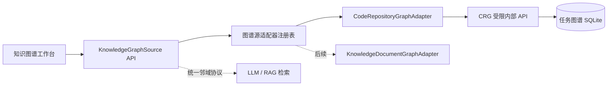

# 知识图谱工作台设计

## 架构

## 统一协议

- `GraphSource`：`id/type/name/project/snapshot/status/stats/capabilities/provenance`。
- `GraphNode`：`id/kind/label/qualified_name/path/location/language/is_test/properties/provenance`。
- `GraphEdge`：`id/kind/source/target/confidence/properties/provenance`。
- `GraphSnapshot`：`source/snapshot/stats/facets/nodes/edges/truncated`。

代码图谱源 ID 使用 `code:<analysis_task_uuid>`，这是不透明业务标识，不包含文件系统路径。未来文档图谱可使用 `document:<snapshot_uuid>`，前端无需改变节点/边渲染协议。

## API

- `GET /api/code-analysis/graph-sources/`：列出当前用户可访问的最新仓库图谱快照。
- `GET /api/code-analysis/graph-sources/{source_id}/graph/`：获取概览、搜索结果或指定节点的有界邻域。
- 参数：`search`、`node_kinds`、`edge_kinds`、`center`、`depth`、`limit`。

Backend 负责项目权限、数据源适配和 schema 校验；CRG 负责在受限任务图谱上读取节点/边。查询上限为 300 节点/800 边，默认 120 节点。

## 界面

- 左栏：数据源类型、仓库图谱列表、Commit 与建图状态。
- 中栏：SVG 图谱画布，支持缩放、平移、搜索、节点/边类型过滤。
- 右栏：节点详情、来源位置、入边/出边和邻域展开。
- 空状态：没有可用图谱时引导到“代码审查”创建审查任务。

## 安全与性能

- CRG 仍旧无宿主机端口，只接受 Backend Bearer Token。
- 只读打开 SQLite；SQL 过滤值全部参数化；节点/边类型使用允许集。
- 前端仅渲染当前响应子图，点击节点时按需换入邻域。
