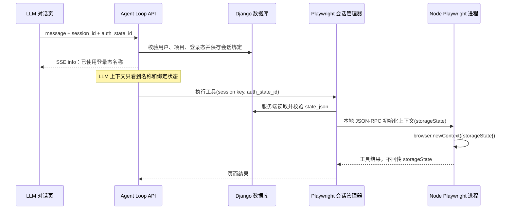

# LLM 探索绑定登录态——技术设计

## 1. 设计目标

在现有 LLM Agent Loop、内置 Playwright Skill 和 `UiAuthState` 之上增加会话级
登录态绑定。用户只传递 `auth_state_id` 或严格格式的登录态名称；完整
`state_json` 仅由 Backend 查询，并通过 Backend 与长驻 Node 进程之间的本地
JSON-RPC 管道注入 Playwright `BrowserContext`。

本设计不改变未绑定登录态的会话行为，也不让 LLM、浏览器前端或普通日志接触
Cookie/token。

## 2. 现状与改造边界

- LLM 请求入口为 `orchestrator_integration/agent_loop_view.py`。
- 每个对话的内置 Playwright 会话键已经包含
  `user_id + project_id + chat_session_id + tool_session_id`，具备并发隔离基础。
- 浏览器上下文由 `persistent_playwright.py` 和
  `playwright_persistent_server.js` 首次执行时创建，目前固定使用空上下文。
- 登录态已存于 `ui_automation.UiAuthState.state_json`，无需新建凭据表。
- 现有 `UiAuthStateSerializer` 会返回 `state_json`，不能直接用于聊天页选择器；
  新功能使用独立的安全摘要接口。

## 3. 总体流程



## 4. 数据模型

### 4.1 ChatSession 会话绑定

在 `ChatSession` 增加：

- `auth_state`: 可空外键，指向 `UiAuthState`，删除登录态时置空。
- `auth_state_bound_at`: 可空时间，记录最近绑定时间。

绑定以服务端保存值为准：

- 新会话未传 `auth_state_id`：保持空绑定。
- 已有会话未传该字段：沿用原绑定。
- 显式传 `null`：解除绑定并关闭该对话已有 Playwright 会话。
- 显式传新 ID：校验后切换绑定，并关闭旧上下文，防止 Cookie 串用。

### 4.2 使用审计

新增 `LlmAuthStateUsage`，仅保存非敏感元数据：

- 用户、项目、ChatSession、`auth_state_id` 和登录态名称快照；
- 目标 origin；
- 开始/结束时间；
- 结果：`started/succeeded/expired/login_redirect/failed/closed`；
- 脱敏错误摘要。

审计表不保存 `state_json`、Cookie、localStorage 或工具完整输入输出。

## 5. API 与绑定规则

### 5.1 登录态安全摘要接口

新增 `GET /api/orchestrator/auth-states/?project_id=<id>`，返回：

```json
{
  "id": 12,
  "name": "星企航测试账号登录态",
  "env_config_id": 3,
  "env_name": "星企航测试环境",
  "base_url": "https://star.test.sseinfo.com",
  "credential_summary": "3 Cookies，2 个 localStorage 域",
  "expires_at": "2026-09-25T10:00:00+08:00",
  "status": "valid"
}
```

接口必须按当前用户可访问项目过滤，且永不序列化 `state_json`。

### 5.2 Agent Loop 请求

流式、非流式和 resume 请求统一支持：

```json
{
  "auth_state_id": 12
}
```

服务端在创建 LLM/加载工具前完成绑定解析。绑定失败直接返回 4xx/SSE error，
不得让模型自行猜测凭据。

### 5.3 文本名称解析

仅识别明确句式，例如 `使用「星企航测试账号登录态」登录态测试...`。
解析范围限定为当前项目、启用中的登录态，并采用名称完全匹配：

- 唯一匹配：绑定并向 UI 返回名称；
- 零匹配：提示选择或重新录制；
- 多匹配：返回候选摘要，要求用户显式选择；
- 请求同时含 ID 和名称时，以 ID 为准，并校验名称一致性。

普通自然语言中偶然出现登录态名称不触发自动绑定。

## 6. 权限、有效性与安全

### 6.1 权限校验

登录态必须满足：

- `env_config.project_id == 当前 project_id`；
- 当前用户具备该项目访问权限；
- `is_active == true`；
- `state_json` 是合法 Playwright storageState 对象。

### 6.2 过期判定

在创建上下文前检查 Cookie：

- 忽略 session cookie（`expires` 缺失、`-1` 或 `0`）；
- 如果快照包含持久 Cookie 且全部已过期，则拒绝注入；
- 部分 Cookie 过期时过滤已过期 Cookie，保留有效项及 origins；
- 注入后若落到已配置的登录 URL，标记 `login_redirect` 并提示重新录制。

环境 `extra_config.llm_auth.login_url_patterns` 可配置登录页 URL 规则；未配置时只使用
保守的 `/login`、`/signin`、SSO host 规则，避免把普通页面误判为登录页。

### 6.3 凭据传输和日志

- Python 会话管理器调用新增的私有 `initialize_context` RPC，把 storageState 放在
  stdin 管道消息中，不放入 shell 命令、环境变量或 LLM 工具参数。
- Node 进程只在内存中持有登录态；关闭/超时/切换时销毁整个浏览器上下文。
- Python/Node 日志仅记录登录态 ID、会话键哈希和状态，不打印 RPC payload。
- 前端只保存选择 ID；不得缓存登录态摘要以外的数据。

## 7. Playwright 会话改造

### 7.1 Python 管理器

`PlaywrightSessionManager.execute_run_js` 增加内部参数 `auth_binding`，内容包含
`auth_state_id` 和服务端读取的 storageState。`_SessionEntry` 只持久记录
`auth_state_id`：

- 新 session：启动 Node 后先初始化带登录态的上下文；
- 同一 auth ID：复用现有上下文；
- auth ID 改变或解除：关闭原进程/上下文后新建；
- 初始化失败：关闭进程并返回脱敏错误。

### 7.2 Node 持久进程

协议增加一次性的 `initialize_context` 方法：

```text
browser.newContext({ ...headers, storageState })
```

一旦上下文已创建，禁止在原上下文上再次注入另一个 storageState；切换必须由
Python 管理器销毁会话。RPC 响应不包含传入数据。

### 7.3 生命周期

- 用户切换/解除登录态：立即关闭当前对话关联的所有 Playwright 子会话。
- 删除聊天、停止并明确结束探索、空闲超时：沿用/扩展现有清理器关闭上下文。
- 异常退出：`atexit` 和现有清理线程兜底。

## 8. 前端交互

在聊天输入区上方增加紧凑的“探索登录态”选择器：

- 默认值为“不使用登录态”；不自动选择环境默认登录态。
- 按环境分组展示名称、凭据摘要、有效/过期状态。
- 发送消息时携带 `auth_state_id`；会话已有绑定时显示
  `已使用：<名称>` 标签。
- 切换已有会话时，从会话详情恢复绑定展示。
- 改选或清除时提示“将关闭当前浏览器探索上下文”，确认后执行。
- 过期/停用项不可选择，并提供“前往环境配置重新录制”的入口。

不把 Cookie 数值、localStorage key/value 或 `state_json` 渲染到 DOM。

## 9. 错误处理

| 场景 | 行为 |
| --- | --- |
| 登录态不存在或跨项目 | 400/403，导航前终止 |
| 登录态停用或已明确过期 | 返回可操作提示，不创建上下文 |
| 名称不唯一 | 返回候选摘要，要求选择 |
| storageState 格式错误 | 标记失败，提示重新录制 |
| 注入后重定向到登录页 | 停止登录后探索，提示重新录制 |
| 浏览器上下文异常退出 | 清理会话，可用同一绑定重新创建 |

## 10. 测试策略

### Backend 单元/集成测试

- 登录态摘要接口不包含 `state_json`，且跨项目不可见。
- ID 绑定、严格名称绑定、名称冲突、解除和切换语义。
- Cookie 过期判定、storageState 格式校验和日志脱敏。
- 不同用户/项目/会话/登录态生成不同浏览器上下文。
- 同一会话同一登录态复用，切换登录态销毁旧上下文。
- stream、non-stream、resume 三条入口行为一致。

### Node 协议测试

- 空绑定创建无痕上下文。
- 首次绑定正确传给 `newContext`。
- 已初始化上下文拒绝二次注入。
- 关闭后内存中无 context/page 引用。

### Frontend 测试

- 选择器只展示安全摘要。
- 发送、切换会话、解除绑定的状态一致。
- 过期项禁用，绑定结果标签正确。

### 本机验收

1. 录制星企航登录态并在 LLM 对话中显式选择。
2. 请求探索 `https://star.test.sseinfo.com/admin/`。
3. 确认首个页面为登录后页面，连续工具调用复用同一上下文。
4. 确认前端网络响应、LLM 消息、Backend/Node 日志均无 Cookie/token。
5. 解除绑定后新探索应回到未登录状态。

## 11. 兼容性与迁移

- 数据库迁移只新增可空字段和审计表，对现有会话无破坏。
- 未传 `auth_state_id` 的新会话保持当前行为。
- 现有 UI 自动化用例的登录态绑定和录制流程不变。
- 通用 `UiAuthState` CRUD 暂不改变返回结构，以免影响现有环境配置页面；聊天页
  必须使用新安全摘要接口。后续可单独治理通用接口的敏感字段暴露。
