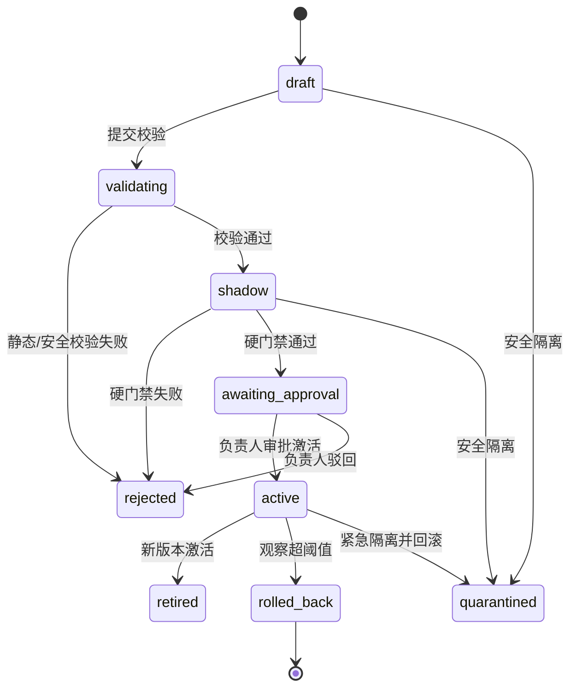

# 生产级质量自进化与 Skill Hub - 技术设计

## 1. 设计决策

### 1.1 一个受控发布内核，两种能力形态

- **Skill 型能力**：`Skill` 是逻辑身份，`SkillVersion` 是不可变包。用例审查、测试方案、用例生成、测试执行和报告生成在运行时锁定具体 `SkillVersion`。
- **复合能力**：代码审查继续使用 `CapabilityDefinition + CapabilityRelease`，发布包仅引用 Prompt、规则、CRG/检索、反证核验和工具配置等子单元的不可变版本与哈希，不生成 Skill ZIP。

两者共用评测、影子对比、审批、激活、生产观察和回滚服务，避免两套发布系统。

### 1.2 复用现有模型

- 保留 `CapabilityDefinition`、`CapabilityRelease`、`EvaluationSuite/Run/Result`、`FailureAttribution`、`OptimizationProposal`、`PromotionDecision` 和 `ReleaseObservation`。
- `CapabilityRelease` 作为唯一发布状态机；`SkillVersion` 不复制发布状态，而是一对一关联一条 `kind=skill` 的发布单元。
- 四阶段唯一真值继续为 `test_plan_generation -> testcase_generation -> test_execution -> report_generation`，并替换自进化引擎中遗留的旧五阶段权重。

## 2. 数据模型

### 2.1 Skill 逻辑身份

扩展现有 `skills.Skill`：

| 字段 | 设计 |
|---|---|
| `project` | 保留，所有查询必须强制按项目过滤 |
| `name` / `description` | 逻辑身份元数据 |
| `capability` | nullable FK -> `CapabilityDefinition`；一个 Skill 绑定一个可进化能力 |
| `active_version` | nullable FK -> `SkillVersion`；为运行时快速解析保留 |
| `is_active` | 兼容字段，新语义为“允许运行”，不代表具体包版本 |

原 `skill_content` / `skill_path` 在过渡期保留只读，新运行时不再直接使用。

### 2.2 SkillVersion

新增 `skills.SkillVersion`：

| 字段 | 设计 |
|---|---|
| `id` | UUID |
| `skill` | FK -> `Skill` |
| `version` | SemVer/可比较版本字符串 |
| `release` | OneToOne -> `CapabilityRelease(kind=skill)` |
| `package_path` | 不可变存储目录 |
| `package_sha256` | 基于标准化文件清单和内容的 SHA-256 |
| `manifest` | 版本、阶段、入口、输入/输出 Schema、依赖和权限声明 |
| `validation_report` | 结构、密钥、静态扫描、Schema 校验结果 |
| `source_type` | upload / git / store / evolution / migration |
| `source_metadata` | 原始文件名、Git URL/commit、商店条目、父版本 |
| `previous_version` | nullable self FK，用于 diff 和回滚 |
| `created_by/created_at` | 审计字段 |

约束：

- `Unique(skill, version)`
- `Unique(skill, package_sha256)`
- 同一 Skill 只允许一条关联 Release 处于 `active`，通过事务锁 + 部分唯一约束保证。

### 2.3 运行时版本锁

新增 `knowledge_evolution.WorkflowSkillLock`：

| 字段 | 设计 |
|---|---|
| `project` | 项目 |
| `workflow_id` | 全链路测试流程 ID |
| `stage` | 四阶段之一 |
| `capability` | 能力定义 |
| `skill` / `skill_version` | 启动时锁定版本 |
| `package_sha256` | 锁定时哈希快照 |
| `locked_at` | 锁定时间 |

约束：`Unique(project, workflow_id, stage)`。

`GenerationOutput` 新增 nullable `skill_version` FK，产出协议同时写入 `skill_id` / `skill_version_id` / `capability_id` / `package_sha256`。

### 2.4 代码审查复合版本

`CapabilityRelease.kind` 新增 `composite`。代码审查 Release `config` 使用固定 Schema：

```json
{
  "schema_version": "code-review-capability/v1",
  "components": {
    "prompt": {"version": "...", "sha256": "...", "ref": "..."},
    "machine_rules": {"version": "...", "sha256": "...", "ref": "..."},
    "retrieval_crg": {"version": "...", "sha256": "...", "ref": "..."},
    "counterevidence": {"version": "...", "sha256": "...", "ref": "..."},
    "tool_config": {"version": "...", "sha256": "...", "ref": "..."}
  },
  "coverage_policy": {"review_all_diff_files": true}
}
```

代码审查任务启动时锁定活跃 Release ID；结果、反证和用户反馈都指向该 Release。

## 3. 包规范与确定性导出

### 3.1 Skill manifest

`SKILL.md` frontmatter 增加下列必填字段：

```yaml
name: test-plan-generator
description: 生成可评测测试方案
version: 1.2.0
stage: test_plan_generation
entrypoint: scripts/main.py
input_schema: schemas/input.json
output_schema: schemas/output.json
permissions: []
```

旧包在迁移时生成 `version=0.0.0-migrated`，新上传严格要求完整 manifest。

### 3.2 安全校验

`SkillPackageValidationService` 使用两阶段：

1. **提交前预检**：在临时目录安全解压，返回 manifest、文件清单、包哈希和问题，不写正式库。
2. **保存候选**：只接受已通过预检且预检令牌未过期的包，重新校验哈希后原子落盘。

扫描内容：

- Zip Slip、符号链接、硬链接、文件数/体积、超长路径。
- `.env`、私钥、证书、Token/API Key/Cookie 模式与高熵可疑凭据。
- 禁止执行文件类型和不在 manifest 权限声明内的外部能力。
- JSON Schema 可解析性、入口存在性和阶段匹配。

### 3.3 确定性 ZIP

`SkillPackageExporter`：

- 路径按 UTF-8 字节序排序，时间戳固定，权限归一化，压缩参数固定。
- 排除 `.git`、`node_modules`、`__pycache__`、`.env*`、日志、缓存、运行产物、上传目录和凭据文件。
- 导出前再做一次敏感数据扫描；命中则转为 `quarantined` 并拒绝下载。
- 使用 `FileResponse` 流式返回，临时文件在响应关闭后删除。

## 4. 核心服务

### 4.1 SkillVersionService

- `preflight(package) -> ValidationReport + short-lived token`
- `create_candidate(token, source_metadata, actor) -> SkillVersion`
- `diff(base, candidate) -> file/content diff`
- `download(version, actor) -> FileResponse`
- `quarantine(version, reason, actor)`

### 4.2 SkillRuntimeResolver

- `resolve(skill_id | capability_id, project_id, workflow_id?, stage?)`
- 使用 `select_related` + 短 TTL 项目级缓存，但任务创建时必须把解析结果持久化为版本锁。
- 拒绝非 `active`、被隔离、跨项目或包哈希不匹配的版本。

### 4.3 SkillEvolutionService

1. 从已确认归因派生候选包。
2. 保存文件级 diff、原因、影响范围和回滚目标。
3. 执行包静态校验。
4. 调用现有评测服务运行分区评测和影子对比。
5. 门禁通过后提交负责人审批。

### 4.4 CapabilityPromotionService

复用现有 `CapabilityReleaseService`，增加原子激活钩子：

- Skill Release 激活：锁定 `Skill` 行，退役旧 Release，更新 `Skill.active_version` 和 `CapabilityDefinition.active_release`。
- 代码审查 Release 激活：只更新 `CapabilityDefinition.active_release`，校验所有子单元 ref/hash 存在。
- 观察超阈值时，反向执行同一原子钩子恢复旧版本。

### 4.5 CodeReviewCapabilityService

- 读取代码审查活跃复合 Release，向审查任务写入 Release ID 和子单元快照。
- 按归因类别仅生成对应子单元补丁，未变部分引用基线版本。
- 影子评测使用同一仓库/提交/全部 Diff 和同一金标分区，对比确定缺陷采纳率、漏报、误报、Token、耗时及 CRG 更新时间。

## 5. API 设计

所有 API 保持在 `/api/projects/{project_id}/skills/` 项目边界内，`get_queryset()` 强制 `project_id` 过滤。

### 5.1 目录和版本

- `GET /skills/` - Skill 目录，含 active/candidate 版本摘要。
- `GET /skills/{skill_id}/versions/` - 版本列表。
- `GET /skills/{skill_id}/versions/{version_id}/` - 版本详情。
- `GET /skills/{skill_id}/versions/{version_id}/diff/?base=...` - 文件级 diff。
- `GET /skills/{skill_id}/versions/{version_id}/download/` - 确定性脱敏 ZIP。

### 5.2 上传和校验

- `POST /skills/preflight/` - 上传 ZIP 并返回校验报告及短期 token，不入正式库。
- `POST /skills/versions/` - 使用 preflight token 保存候选版本。
- 现有 `upload/import-git/import-zip-url` 过渡为内部调用同一 preflight/create 服务，保持旧调用兼容。

### 5.3 评测和发布

- `POST /versions/{id}/evaluate/`
- `POST /versions/{id}/submit-approval/`
- `POST /versions/{id}/approve/`
- `POST /versions/{id}/reject/`
- `POST /versions/{id}/activate/`
- `POST /versions/{id}/rollback/`
- `POST /versions/{id}/quarantine/`

每个状态变更接口必须验证前置状态、用户角色、门禁快照和幂等键。

### 5.4 能力绑定与运行锁

- `GET/PATCH /skills/{id}/capability-binding/`
- `GET /operations/workflow-skill-locks/?workflow_id=...`
- 业务模块不允许由前端直接指定任意版本；只能指定 Skill/能力，由后端 Resolver 选择 active 版本并建立锁。

## 6. 业务接入

### 6.1 用例审查

- 创建任务时用 `selected_skill_id` 解析 active `SkillVersion`，保存到审查任务。
- 无 active 版本时拒绝新任务，历史任务仍能读取已锁定版本。
- 发布产出时绑定 `capability` 和 `skill_version`。

### 6.2 全链路测试

- 测试方案启动时创建 workflow 和四阶段 Skill lock。
- 用例生成、测试执行和报告生成必须读取已有 lock，不得在链路中途重新解析 active 版本。
- 每个阶段在调用 Skill 前检查上一阶段门禁，在返回产出后创建当前阶段待评门禁。
- 自进化引擎同时生成“单阶段”和“四阶段端到端”两份评测报告。

### 6.3 报告生成

- 报告必须引用测试方案、用例和执行产出 ID，并对覆盖率、通过率、失败分布和未闭环问题做 Schema 校验。
- 报告门禁是链路终态；只有通过后 workflow 才标记完成。

## 7. 评测与发布状态机



## 8. Skill Hub 界面设计规格

### DESIGN SPECIFICATION

1. **Purpose Statement**：面向测试负责人和执行人员，把 Skill 的安装、版本、评测、发布与回滚组织为可操作的生产控制面。用户应能在一屏内判断“当前在跑什么版本、候选为什么改、是否允许发布”。
2. **Aesthetic Direction**：Industrial/utilitarian（工业化控制台）。强调状态、版本、门禁和可追溯性，不使用娱乐化卡片。
3. **Color Palette**：遵循现有 WHartTest/Arco 品牌约束，窄幅覆盖 UI Skill 的默认禁用色规则；主蓝 `#1677FF`、深灰 `#1F2937`、页面灰 `#F5F7FA`、成功绿 `#00B42A`、警告橙 `#FF7D00`。状态色只用于门禁和风险。
4. **Typography**：继承平台已有字体 token，不在单个业务页引入外部字体，避免离线环境不可用和全平台排版断裂。版本、哈希和日志使用现有等宽字体 token。
5. **Layout Strategy**：左侧 300px Skill 目录与筛选，中间为版本轨道与基线/候选对比，右侧 360px 为门禁与发布操作栏。小屏收敛为目录抽屉 + 版本主区 + 发布底部抽屉，不简单把三列堆叠为无穷长页。

### 8.1 页面分区

- 顶部：项目、Skill 总数、活跃版本、待审批、隔离数，以及“上传候选”、“从 Git 导入”、“Skill 商店”。
- 左列：阶段分组的 Skill 目录，显示活跃版本、候选数、最近评测和异常标记。
- 中列：版本时间轴、manifest、文件 diff、能力绑定、来源与完整性。
- 右列：校验清单、分区评测、基线/候选指标、缺失条件、审批/驳回/激活/回滚。
- 时间线：展示上传、校验、评测、审批、激活、观察和回滚审计事件。

## 9. 迁移策略

1. 新增模型和 nullable 关联，先不改旧运行时。
2. 数据迁移为每个现有 Skill 生成 `0.0.0-migrated` 版本和 `kind=skill` Release，只有原 `is_active=true` 时设置为 active。
3. 双读阶段：优先读 `active_version`，旧 Skill 未迁移时临时回退到旧路径并记告警。
4. 回填五个 Skill 业务入口的能力绑定，再切换到严格模式。
5. 严格模式下移除运行时回退，保留旧字段仅供历史查看。

迁移必须是可重入的，文件哈希不一致时停止而不覆盖。

## 10. 安全与权限

- ~~修复 `SkillViewSet.get_queryset()` 当前返回全量 Skill 的项目隔离问题，所有 detail action 同样受项目查询集约束。~~ **（2026-10-02 / T27 修订）**：`get_queryset()` 拆两路 —— **读侧**（`list`/`retrieve`）返回全量（Skill Hub 是平台级公共目录，列表按名称归并出正本，`copies` 暴露副本数）；**写侧**（`destroy`/`upload`/`toggle`/`preflight`/`candidate`/`activate`/`rollback`/`quarantine`/`download`）仍按 URL 中的 `project_id` 过滤。
- **（2026-10-02 / T27 新增）阶段补填**：manifest 未声明阶段的 Skill 由平台管理员或项目测试负责人补填 `Skill.declared_stage`（端点 `POST /projects/{id}/skills/{id}/stage/`，权限 `projects.roles.IsTestLeadAnywhere`）。**不写回版本 manifest** —— 版本包不可变，改写会让包哈希对不上（`package_tampered`）。阶段解析优先级：`manifest.stage` > `declared_stage` > 未声明。
- 上传和验评允许测试执行人员；审批、激活、回滚、隔离仅允许测试负责人。
- 下载需项目访问权限，且每次动态生成脱敏包；不提供直接媒体路径。
- 所有审批类请求要求 reason 和 idempotency key。
- 活跃版本哈希与文件不一致时立即隔离，阻止新任务并回滚。

## 11. 失败与一致性

- 上传文件落盘成功但事务失败：清理未引用目录。
- 数据库提交成功但后续评测失败：保留 draft/rejected 版本与诊断，不删除证据。
- 激活过程失败：整个激活事务回滚，原 active 不变。
- 生产观察触发回滚失败：能力进入紧急隔离，阻止新任务并生成高优先级审计事件。
- 飞轮记录仍遵循 best-effort，但生产版本解析和阶段门禁遵循 fail-closed。

## 12. 测试策略

### 12.1 后端

- 模型约束：不可变、版本/哈希唯一、单 active、项目隔离（**2026-10-02 / T27 修订**：隔离仅作用于写侧；读侧为公共目录，同名按名称归并正本）。
- 包安全：Zip Slip、符号链接、zip bomb、密钥扫描、确定性导出和重导入。
- 状态机：非法跳转、未通过门禁发布、并发激活、回滚、隔离。
- 运行锁：中途发布新版本不影响已运行 workflow。
- 代码审查：复合版本子单元完整性、全 Diff 覆盖和反证证据。

### 12.2 前端

- 上传预检、问题展示、候选保存和重复包处理。
- 版本切换、diff、下载、评测指标、缺失门禁提示。
- 不同角色的按钮可见性与后端 403 一致。
- 窄屏目录/发布抽屉和长 diff 性能。

### 12.3 真实链路

- 用例审查产出锁定版本并生成单次评测。
- 测试方案 -> 用例 -> 执行 -> 报告共用 workflow_id，且各阶段门禁能真实阻断。
- 代码审查基线/候选使用相同 commit 对和完整 Diff，对比 Token、耗时、采纳率、漏报、误报和 CRG 耗时。

## 13. 可观测性

- 指标：上传/校验失败率、版本解析耗时、影子评测队列时间、门禁通过率、生产回归率、自动回滚次数。
- 日志维度：project_id、skill_id、skill_version_id、capability_id、release_id、workflow_id、actor_id。
- 审计事件不保存包原文或密钥，只保存哈希、动作、结果和必要诊断。
