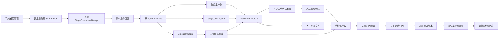

# 上证 e 投票质量飞轮—Agent 执行—Skill 自进化联动设计

> 状态：设计稿  
> 适用范围：上证 e 投票项目的方案生成、用例生成、测试执行、报告产出四阶段  
> 依赖基线：本目录 `requirements.md`、`design.md` 及平台现有统一产出协议、阶段门禁、SkillVersion、金标和评测能力。

## 1. 目标与原则

本设计打通以下闭环：

```text
质量飞轮发起流程
→ 锁定四阶段 SkillVersion
→ 跳转原业务页面并调用同一套 Agent
→ 记录可观察执行事件
→ 提交业务主产物与标准产出信封
→ 平台生成确认报告、证据图谱和质量摘要
→ 人工最小化确认及补充文件上传
→ 结构化差异与失败归因
→ Skill 内容候选版本
→ 冻结数据集对照评测
→ 人工审批、激活、观察和回滚
```

核心原则：

1. 不新建第二套 Agent。质量飞轮是控制面、观测面和反馈面，原业务页面与 Agent Runtime 是执行面。
2. 不强制所有 Skill 生成相同 Excel、PDF 或 HTML，只统一机器可读的产出信封。
3. 人工只做无法可靠自动化的判断，确认表仅保留四个人工列。
4. 上传确认稿、生成候选、评测和发布是四个独立动作，任何一步都不得隐式触发下一步。
5. 历史产物、人工上传文件和一次人工结论都只能成为候选，不能自动成为金标。
6. 运行中版本不可漂移，历史流程必须可复现。

## 2. 架构边界

| 层面 | 负责 | 不负责 |
| --- | --- | --- |
| 飞轮控制面 | 创建流程、锁定版本、阶段门禁、执行派发 | 重写方案/用例生成逻辑 |
| Agent 执行面 | 模型调用、检索、工具执行、业务文件生成 | 自动激活 Skill 新版本 |
| 飞轮观测面 | 运行尝试、工具轨迹、引用、正式产出 | 保存或展示隐藏思维链 |
| 人工反馈面 | 三态结论、修改内容、补充文件 | 自动把上传文件认定为金标 |
| Skill 进化面 | 归因、最小补丁、候选评测 | 未经审批直接发布 |

### 2.1 结构化决策记录

平台不采集、不展示、也不依赖模型隐藏思维链。需要被观测和评测的是模型显式提交的结构化决策记录：

- 当前结论；
- 引用的需求和知识证据；
- 简明决策依据；
- 被排除的备选方案及原因；
- 假设与不确定项；
- 反证检查与确定性校验结果。

结构化决策记录是可验证的正式输出，不等同于模型内部思维链。

### 2.2 两种运行模式

受控模式从飞轮发起，显式携带 `workflow_id` 和阶段上下文；运行前校验门禁并锁定 SkillVersion，正式产出登记当前阶段门禁。

旁路模式从方案分析等业务页面直接发起；Agent 正常执行并旁路沉淀，但不创建或改变受控门禁。用户可以事后显式“纳入质量飞轮”。两种模式必须共用同一 Agent Runtime。

## 3. 总体流程



## 4. 飞轮到 Agent 的执行联动

### 4.1 发起流程

测试负责人为四阶段选择具体 `SkillVersion`。后端创建 `FlywheelRun`，写入 `WorkflowSkillLock` 并建立阶段门禁初始状态。

发起流程只负责创建流程和锁定版本，不直接调用 Agent。

### 4.2 阶段执行入口

按钮按真实行为命名：

| 阶段 | 按钮 |
| --- | --- |
| 方案生成 | 去方案分析执行 |
| 用例生成 | 去用例生成执行 |
| 测试执行 | 选择套件并执行 |
| 报告产出 | 去报告生成执行 |

后端依次：

1. 校验项目、流程和阶段；
2. 校验上一阶段门禁；
3. 读取锁定 SkillVersion；
4. 解析 `parent_output_ids`；
5. 创建 `StageExecutionAttempt`；
6. 生成短期有效的 `execution_context_id`；
7. 返回业务页面 `launch_url`。

前端只携带 `execution_context_id`。业务页面必须从后端解析可信上下文，不以可篡改 Query 参数作为版本锁依据。

### 4.3 业务页面受控模式

- 显示“已关联质量飞轮流程”横幅；
- SkillVersion 只读；
- 展示上游产出、需求文档和 attempt；
- Agent 请求强制携带 `attempt_id`；
- 项目切换、上下文失效或版本不一致时拒绝执行；
- Agent 完成后接收 `output_published` 事件并提供返回飞轮入口。

### 4.4 `StageExecutionAttempt`

状态机：

```text
planned → dispatched → running → output_published → completed
                                  ↘ failed/cancelled/timed_out
```

关键字段：

```text
project / flywheel_run / workflow_id / stage
skill_version / parent_output_ids / session_id / entry_type
status / output / retry_of / error_code / error_summary
idempotency_key / requested_by / 时间字段
```

Attempt 表示一次运行，即使失败也存在；`GenerationOutput` 表示正式产出，只有正式发布才存在。

### 4.5 正式 SSE 事件

```json
{
  "event": "output_published",
  "attempt_id": "attempt-xxx",
  "output_id": "output-xxx",
  "workflow_id": "wf-xxx",
  "stage": "test_plan_generation"
}
```

页面不得继续只靠聊天文本或文件名判断阶段完成。

## 5. Agent 中间过程与证据图谱

### 5.1 可观察事件

```text
attempt.created / attempt.started
input.prepared
retrieval.started/completed/failed
tool.started/completed/failed
artifact.created
validation.started/completed/failed
output.published
attempt.completed/failed
```

飞轮实时展示业务摘要，详细信息下钻到 `ExecutionSpan`。

工具轨迹默认只保存工具名、版本、输入输出哈希、状态、耗时、Token、受限错误摘要和证据定位，不复制账号、凭据、完整敏感参数和大段返回正文。

### 5.2 执行证据图谱

平台基于 `ExecutionSpan`、知识引用、结构化决策记录、正式产出和人工反馈生成 `execution_evidence_graph.json`。

节点类型：

```text
Requirement / InputDocument / KnowledgeDocument / KnowledgeChunk
EvidenceQuote / RetrievalQuery / AgentStep / ToolCall / DecisionRecord
OutputClaim / PlanItem / TestCase / ExecutionResult / ReportFinding
Artifact / HumanEdit / Attribution / SkillRule / SkillPatch / EvaluationResult
```

边类型：

```text
DERIVED_FROM / RETRIEVED_FROM / QUOTES / SUPPORTS / CONTRADICTS
USED_BY / GENERATED_BY / PRODUCES / MODIFIED_TO / OMITTED_BY
ATTRIBUTED_TO / FIXED_BY / VERIFIED_BY / SUPERSEDES
```

### 5.3 知识原句定位

必须区分：

```text
retrieved：检索到
declared：Agent 声称使用
verified：平台定位验证通过
contradicted：存在反证
invalid：引用无法定位
```

引用最少包含：

```text
document_id / document_version / chunk_id
quote / start_offset / end_offset / content_hash
```

平台验证 quote 是否真实存在于指定文档版本和 Chunk。失败引用不得展示为可信证据。

## 6. 标准化产出协议

### 6.1 统一产出信封，不统一业务文件

各 Skill 可以继续生成自己的 Excel、PDF、HTML、日志或截图。每个 Skill 最少额外提交：

```text
stage_result.json
```

平台据此生成：

```text
阶段确认报告.xlsx
execution_evidence_graph.json
stage_quality_summary.json
```

### 6.2 `stage-result/v1`

一期必填：

```json
{
  "schema_version": "stage-result/v1",
  "stage": "test_plan_generation",
  "status": "completed",
  "primary_artifacts": [],
  "items": [
    {
      "id": "TP-018",
      "title": "非白名单账户反向校验",
      "requirement_ids": ["REQ-12"],
      "evidence_ids": ["EV-001"]
    }
  ],
  "evidence": [
    {
      "id": "EV-001",
      "document_id": "doc-21",
      "document_version": "v3",
      "chunk_id": "chunk-108",
      "quote": "非白名单证券账户不得进入后续投票处理流程。"
    }
  ]
}
```

决策摘要、备选方案、反证和不确定项作为推荐字段；工具调用由 Runtime 记录，不要求 Skill 重复输出。

### 6.3 阶段适配器

```python
class StageOutputAdapter:
    def parse(self, artifacts) -> StageResult: ...
    def build_review_report(self, stage_result) -> bytes: ...
    def build_evidence_graph(self, stage_result, trace) -> dict: ...
    def build_quality_summary(self, stage_result, trace) -> dict: ...
```

分别实现方案、用例、执行和报告适配器。平台后续只依赖统一 `StageResult`，不直接依赖某个 Excel 的列号。

## 7. 最小人工确认

### 7.1 人工字段

确认报告人工留空列固定为：

```text
人工结论
修改类型
修改内容
备注
```

人工结论初始为空，只允许：

```text
采纳
修改后采纳
删除
```

空白就是未审核，不提供“待确认”。

| 结论 | 修改类型 | 修改内容 | 备注 |
| --- | --- | --- | --- |
| 采纳 | 不填 | 不填 | 可选 |
| 修改后采纳 | 必填 | 必填 | 可选 |
| 删除 | 必填 | 不填 | 可选 |

修改类型：内容错误、覆盖不足、粒度不当、证据错误、优先级不当、重复或无效、其他。

### 7.2 确认报告

方案阶段建议 Sheet：

1. `方案项确认`
2. `异常证据`
3. `执行摘要`
4. `确认汇总`

最后一个 Sheet 保留“采纳率”标签以兼容现有解析器，同时计算原始项数、已/未审核数、采纳数、修改后采纳数、删除数、原样采纳率、有效保留率、修改率、删除率、确认完成率和证据准确率。

服务端必须重新扫描明细计算指标，不能完全信任 Excel 公式缓存。

### 7.3 草稿与提交

- 存在空白：允许保存草稿，不允许进入 Skill 进化；
- 修改后采纳缺修改类型或修改内容：拒绝正式提交；
- 删除缺修改类型：拒绝正式提交；
- 全部必审项完成后形成正式反馈版本。

页面支持筛选和主动批量采纳当前筛选结果，但不得默认自动采纳。

### 7.4 人工补充文件

人工不在确认报告中逐行录入新增方案或新增用例。完整补充内容在飞轮对应阶段单独上传，文件用途为：

```text
确认后完整产物 / 人工补充产物 / 参考附件 / 问题证据
```

每个文件绑定：

```text
project_id / workflow_id / stage / output_id
document_purpose / file_hash / uploaded_by / uploaded_at
```

上传文件只作为反馈和优化证据，不自动成为金标，也不自动修改或激活 Skill。

## 8. 差异、归因与 Skill 自进化

### 8.1 工坊输入

1. 原始输入快照；
2. Agent 原始业务产物；
3. `stage_result.json`；
4. 执行证据图谱；
5. 正式人工确认报告；
6. 人工补充文件；
7. 当前 SkillVersion 包；
8. 历史归因和回归案例。

### 8.2 自动差异与归因

平台识别原样采纳、修改后采纳及字段级差异、删除、人工补充、错误或缺失证据、未覆盖需求和格式契约问题。

通过图谱反查：

```text
HumanEdit
→ 原业务项
→ DecisionRecord
→ EvidenceQuote
→ KnowledgeChunk / Requirement
→ AgentStep / ToolCall
→ SkillRule
```

责任层沿用意图、规划、Prompt、知识、检索、Skill/工具、环境、下游结果八层。自动化只创建待确认归因，负责人确认后才能生成候选。

### 8.3 `skill_content` 候选

允许生成最小补丁的白名单：

- `SKILL.md`
- 相关 `references/*.md`
- `schemas/*.json`
- 输出模板
- 确定性校验脚本

候选必须来自已确认归因，创建新的不可变 `SkillVersion`，保留基线版本和回滚目标，禁止直接修改 active 包。

### 8.4 评测与晋级

候选与基线必须使用相同冻结数据集和模型配置。晋级硬门禁：

- 本轮 Badcase 修复；
- 关键回归案例零退化；
- 优化样本不计入隐藏集成绩；
- schema 和文件契约通过；
- 无新增业务臆造；
- 延迟、Token 和成本不超阈值；
- 测试负责人审批后才能激活。

## 9. 旁路产出纳管

直接从业务页面生成时，自动创建或复用普通 `FlywheelRun`，保存版本、轨迹和产出，标记“未纳入受控流程”，不改变门禁。

新增 `WorkflowStageSubmission` 或等价绑定模型，不直接篡改历史 `GenerationOutput.metadata`。纳管前校验项目、阶段、SkillVersion、父产出和目标阶段冲突。

每次重跑创建新 attempt，新产出通过 `supersedes_output_id` 指向旧产出；旧产出、门禁和反馈保留，新产出重新评测。首期禁止同阶段并行分支。

## 10. Skill 兼容等级

| 等级 | 能力 |
| --- | --- |
| L0 普通文件 | 可下载，无结构化评审 |
| L1 可识别产物 | 明确主产物，不再靠文件名猜 |
| L2 可评审产物 | 提供结构化 items，可生成确认报告 |
| L3 可进化产物 | 提供需求、证据和决策记录，可归因和派生补丁 |

首期只把“上证 e 投票测试方案生成”升级为 L3，其他 Skill 保持可运行并逐步迁移。

## 11. API 建议

执行联动：

```text
POST /knowledge-evolution/operations/start-workflow/
POST /knowledge-evolution/operations/execute-workflow-stage/
GET  /knowledge-evolution/execution-contexts/{id}/
GET  /knowledge-evolution/stage-attempts/{id}/
GET  /knowledge-evolution/stage-attempts/{id}/events/
```

正式产出与证据：

```text
POST /knowledge-evolution/stage-attempts/{id}/publish-output/
GET  /knowledge-evolution/generation-outputs/{id}/lineage/
GET  /knowledge-evolution/generation-outputs/{id}/evidence-graph/
GET  /knowledge-evolution/generation-outputs/{id}/review-report/
```

人工反馈：

```text
POST /knowledge-evolution/generation-outputs/{id}/review-draft/
POST /knowledge-evolution/generation-outputs/{id}/review-submit/
POST /knowledge-evolution/generation-outputs/{id}/supplemental-artifacts/
GET  /knowledge-evolution/generation-outputs/{id}/review-summary/
```

语义必须分离：上传反馈不顺带派生，派生不顺带发布。

## 12. UI 建议

质量飞轮每个阶段提供：

1. `产出物`
2. `执行链路`
3. `证据图谱`
4. `质量与反馈`

证据图谱默认以业务项为中心：

```text
需求点 → 知识原句 → 决策记录 → 业务项
                         ↓
                    人工修改 → 归因 → Skill 补丁 → 回归结果
```

运行中展示业务摘要，不展示隐藏思维链、账号凭据、完整敏感参数或未经权限校验的知识正文。

## 13. 失败、补偿与安全

业务生成成功和飞轮登记成功分别展示。飞轮写入失败不得让业务产物丢失，也不得只记日志；通过幂等事件、重试和死信队列补偿。

Agent 在正式发布前失败时，attempt 标记失败，已有 Span 保留，临时文件不冒充正式产出；重试创建新 attempt 并通过 `retry_of` 关联。

所有流程、产出、证据、反馈、文件和候选必须带 `project_id`。知识原句按原文权限展示；敏感数据必须脱敏或禁止进入优化数据；人工上传文件保存哈希和原版本，不覆盖原产出。

## 14. 分期实施

### 一期：受控联动与 L3 方案 Skill

1. 新增 `StageExecutionAttempt` 和 execution context；
2. 飞轮自动跳转方案分析；
3. 方案页受控模式与 `output_published`；
4. e投票方案 Skill 输出 `stage_result.json`；
5. 平台生成确认报告、质量摘要和首版图谱；
6. 支持三态确认及阶段补充文件上传。

### 二期：Skill 内容进化

1. 方案项级差异；
2. 图谱反向归因；
3. 人工确认归因；
4. `skill_content` 最小补丁；
5. 基线/候选冻结集评测；
6. 审批、灰度、激活和回滚。

### 三期：扩展与兼容

1. 旁路产出纳管；
2. 用例、执行和报告适配器；
3. 实时图谱增量刷新；
4. 多阶段证据图谱合并；
5. Badcase 聚类和回归推荐；
6. 质量、成本、延迟联合门禁。

## 15. 核心验收场景

### A. 受控方案生成

飞轮锁定 e投票方案 Skill v1.0，点击“去方案分析执行”；页面自动恢复上下文且 Skill 不可改；执行中可见检索、工具和文件事件；完成后飞轮收到正式 `output_id` 和待评测门禁。

### B. 知识原句追溯

方案项声明知识原句，平台验证文档版本、Chunk、offset 和哈希；图谱显示原句支持哪个方案项；定位失败标记 invalid。

### C. 最小人工确认

人工列初始为空；用户只选择采纳、修改后采纳、删除；存在空白时可保存草稿但不能正式提交；服务端重算统计。

### D. 人工补充用例

用户在用例阶段上传人工补充文件；文件绑定项目、流程、阶段和原始产出；未经审核不得自动成为金标或激活 Skill。

### E. Skill 自进化

人工修改暴露关键遗漏；图谱证明需求和知识已存在且已召回；系统提出 Skill/规划层归因；负责人确认后生成最小补丁和候选版本；回归零退化后审批激活，旧流程仍可复现旧版本。

### F. 失败补偿

Agent 中途失败且无正式产出时，飞轮仍显示失败 attempt 和已有 Span；重试保留原记录；飞轮登记失败进入补偿队列，不影响业务文件。

## 16. 实施任务

- [ ] 1. 建立 `StageExecutionAttempt`、execution context、幂等和重试关系。
- [ ] 2. 改造派发接口，返回可信上下文和 `launch_url`。
- [ ] 3. 完成飞轮自动跳转、方案页受控模式和正式产出 SSE。
- [ ] 4. 定义 `stage-result/v1`、schema 校验和兼容等级。
- [ ] 5. 为 e投票方案 Skill 增加稳定项 ID、证据引用和结构化决策记录。
- [ ] 6. 实现方案适配器、确认报告、质量摘要和证据图谱。
- [ ] 7. 实现三态确认、草稿/提交和服务端统计重算。
- [ ] 8. 实现阶段补充文件上传、权限、哈希和用途分类。
- [ ] 9. 实现结构化差异、证据反查和待确认归因。
- [ ] 10. 扩展 `skill_content` 候选与不可变 SkillVersion。
- [ ] 11. 实现对照评测、关键零退化门禁、审批和回滚。
- [ ] 12. 实现旁路纳管、替换语义、失败补偿和端到端回归。

## 17. 结论

本方案不统一所有业务文件，而是统一：

```text
执行上下文
+ 运行尝试
+ 标准产出信封
+ 结构化业务项
+ 证据引用关系
+ 最小人工确认
+ 受控 Skill 候选
```

确认报告、证据图谱、统计和进化输入由平台统一生成，使飞轮能够准确回答：产出基于哪个版本、Agent 实际执行了什么、哪句知识支持哪个结论、人工修改了什么、问题归因到哪里、Skill 为什么要这样改，以及新版本是否真实改善且没有关键退化。
