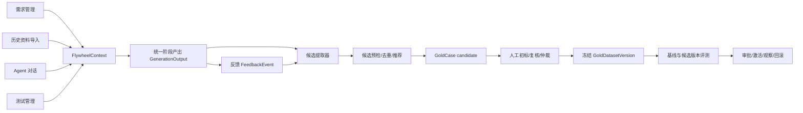

# 上证 e 投票全流程 Skill 数据飞轮 — 技术设计

> 需求基线：`requirements.md`。本设计复用现有 `knowledge_evolution`、`skills`、`requirements`、`testcases` 和 Agent Loop，不另建平行飞轮。

## 1. 设计目标

本期把现有“能记录产出、反馈、金标和版本”的基础设施补齐为按项目隔离的生产闭环：

1. 历史需求与真实产物可导入、回放和对照；
2. 在线四阶段产出可形成金标候选；
3. 自动化负责候选发现、预检、去重和推荐，人工负责所有正式测试集准入；
4. 金标主集、回归分区和上证 e 投票专用集可组合；
5. 需求管理、Agent 对话、测试管理和飞轮页面共享同一 `FlywheelContext`；
6. Skill Hub 公开共享；项目的 Skill 选择与版本锁、知识库、数据集、评测和发布严格隔离。

## 2. 现状约束与关键决策

### 2.1 复用现有能力

- `GenerationOutput` 已绑定项目、检索轨迹、能力和实际 `SkillVersion`。
- `FeedbackEvent` 已绑定产出、发布单元、Skill 版本和证据。
- `GoldDataset → GoldDatasetVersion → GoldCase` 已支持候选、分区、冻结版本与隐私策略。
- `GoldAnnotation` 已支持初标、复核和仲裁；`GoldVersionService.freeze()` 已阻止未确认样本冻结。
- `WorkflowSkillLock` 已能按项目、流程和阶段锁定 Skill 版本。
- `TestExecution` 已有 `workflow_id` 与 `source_output`，执行结束后可回写飞轮。
- Agent Loop 已能根据 `module_key`、`workflow_id`、`parent_output_ids` 提交统一产出。

### 2.2 公开 Skill Hub 与项目级执行绑定

Skill Hub 保持全平台公开，承载 Skill 商店、内容和版本管理。`Skill.project` 只记录上传来源，不作为公开目录的读取边界。隔离对象是项目执行前的选择、任务锁和执行后产生的数据，而不是 Skill Hub 条目本身。

决策：

- 项目启动流程前，必须为每个受管阶段从 Skill Hub 显式选择 `SkillVersion`；不以商店当前活跃版本替代人工选择。
- 选择写入项目级 `WorkflowSkillLock`，同一流程重试或恢复始终使用锁定版本。
- 不同项目可选择同一 Skill 的不同版本；项目反馈、候选、评测和发布决策按项目归因。
- Skill Hub 后续新增或激活版本不得改变已有流程锁，也不得自动改写其他项目的执行选择。
- 私有知识、金标、产出等跨项目外键组合在服务层与数据库约束可覆盖处双重校验。

### 2.3 数据集两个正交维度

- **业务归属**：由 `GoldDataset` 表达，例如“上证 e 投票测试用例生成专用集”。
- **评测用途**：由 `GoldCase.split` 表达，例如 `gold/regression/fresh/challenge/hidden`。

不新增“回归数据集副本”。同一 `GoldCase` 只存在一份，通过所属专用数据集和 `split=regression` 同时表达“上证 e 投票专用回归案例”。

### 2.4 人工审核不允许旁路

现有 `GoldAnnotationService` 已要求初标、复核并在不一致时仲裁。设计沿用该模型：自动候选永远从 `candidate` 开始，只有人工标注形成 `confirmed`，且数据集版本内所有案例均为 `confirmed` 后测试负责人才能冻结。

任何“高置信自动确认”逻辑均不实现；客观执行结果只提高推荐优先级，不改变审核门禁。

## 3. 总体架构



### 3.1 模块边界

| 模块 | 职责 | 不负责 |
| --- | --- | --- |
| `flywheel_context` | 创建、解析和校验跨入口上下文 | 执行阶段业务 |
| `asset_ingestion` | 历史包导入、文件哈希、阶段匹配、隐私预检 | 自动认定金标 |
| `gold_candidates` | 候选提取、去重、价值评分、推荐归属 | 跳过人工审核 |
| `gold` | 标注、冲突、冻结、退役 | Skill 派生 |
| `evaluation` | 冻结集物化、基线/候选对照、门禁 | 修改数据集内容 |
| `skill_evolution` | 基于已确认归因派生候选版本 | 自动激活 |
| 各业务入口 | 传递上下文、提交正式产出 | 自建飞轮表 |

## 4. 数据模型设计

### 4.1 继续使用的实体

- `RetrievalTrace`
- `GenerationOutput`
- `FeedbackEvent`
- `WorkflowSkillLock`
- `WorkflowStageGate`
- `GoldDataset`
- `GoldDatasetVersion`
- `GoldCase`
- `GoldAnnotation`
- `AnnotationConflict`
- `EvaluationSuite/EvaluationRun/EvaluationResult`
- `CapabilityDefinition/CapabilityRelease`
- `Skill/SkillVersion`

### 4.2 新增 `FlywheelRun`

用途：将现在散落在请求参数和 `GenerationOutput.metadata.protocol` 中的流程上下文变成可校验的一等实体。

字段：

| 字段 | 说明 |
| --- | --- |
| `id` | UUID |
| `project` | 必填，项目所有权 |
| `workflow_id` | 项目内稳定流程标识 |
| `entry_type` | `requirement/chat/test_management/flywheel/history_replay` |
| `intent` | `production/history_replay/shadow_evaluation` |
| `requirement_document_ids` | 输入文档 ID 快照 |
| `status` | `draft/running/completed/failed/cancelled` |
| `created_by` | 发起人 |
| `metadata` | 非权威扩展信息 |

约束：`(project, workflow_id)` 唯一。所有阶段锁、门禁、产出和测试执行必须与 `FlywheelRun.project` 一致。

兼容：保留现有字符串 `workflow_id`；新增关联逐步回填，避免一次性重写所有调用方。

### 4.3 扩展 `GoldDataset`

新增字段：

| 字段 | 说明 |
| --- | --- |
| `scope_type` | `general/domain` |
| `scope_key` | 业务范围标识；上证 e 投票为 `sse_evote` |
| `governance` | 审核策略快照；默认人工初标+负责人复核 |
| `taxonomy_version` | 采用的业务分类版本 |
| `approver` | 测试负责人 |

唯一约束调整为 `(project, name, task_type, scope_key)`；`scope_key` 不跨项目共享语义对象。

### 4.4 新增 `TestAssetTaxonomy`

用途：保存由测试负责人维护和审批的专用业务分类、关键场景清单与版本。

字段：

| 字段 | 说明 |
| --- | --- |
| `project` | 必填 |
| `scope_key` | `sse_evote` |
| `version` | 不可变版本号 |
| `state` | `draft/review/published/retired` |
| `categories` | 树形业务分类 JSON |
| `critical_scenarios` | 关键场景及覆盖要求 JSON |
| `maintained_by` | 测试负责人 |
| `approved_by/approved_at` | 审批留痕 |
| `content_hash` | 冻结内容哈希 |

发布后不可修改；变更创建后继版本。`GoldDataset.taxonomy_version` 指向已发布版本。

### 4.5 扩展 `GoldCase`

新增字段：

| 字段 | 说明 |
| --- | --- |
| `candidate_origin` | `history/feedback/defect/missed/false_positive/rollback/manual` |
| `candidate_score` | 推荐优先级，不是审核结论 |
| `recommended_split` | 自动推荐分区 |
| `recommended_tags` | 自动推荐业务分类 |
| `dedup_fingerprint` | 规范化输入+期望的精确指纹 |
| `review_checklist` | 来源、证据、隐私、字段完整性预检结果 |

`tags` 只写入人工确认后的最终标签；自动推荐与最终结论分开，避免页面把模型建议误当事实。

### 4.6 新增 `AssetCandidateEvent`

用途：候选发现的幂等队列和补偿记录，解决飞轮写入失败只记日志的问题。

字段：`project`、`source_type`、`source_id`、`idempotency_key`、`status`、`attempts`、`last_error`、`candidate`、`created_at/processed_at`。

状态：`pending/processing/needs_review/completed/failed/dead_letter`。业务任务提交后以事务 `on_commit` 创建事件；异步任务失败可重试，超过阈值进入死信并在控制台告警。

### 4.7 关系与隔离不变量

1. `GoldCase.version.dataset.project == source_output.project == source_feedback.project`。
2. `WorkflowSkillLock.project == GenerationOutput.project`，且产出的 `SkillVersion` 必须等于该项目流程锁选定的公开版本。
3. `CapabilityDefinition.project == CapabilityRelease.project == GenerationOutput.project`。
4. `KnowledgeBase.project == RetrievalTrace.project == GenerationOutput.project`。
5. `FlywheelRun.project == WorkflowStageGate.project == TestExecution.project`。
6. 任一不变量失败：事务回滚、返回 4xx、写安全审计事件。

## 5. 核心服务设计

### 5.1 `FlywheelContextService`

统一输入：`project_id/workflow_id/stage/entry_type/intent/requirement_document_ids/parent_output_ids`。

职责：

- 创建或读取 `FlywheelRun`；
- 校验项目成员权限；
- 校验阶段和上游产出均属于当前项目/流程；
- 校验并锁定当前项目从 Skill Hub 选定的 Skill 版本；
- 返回不可变执行上下文，供 Agent Loop 和测试执行使用。

前端不再要求用户手工复制 `module_key`、`workflow_id` 或 `source_output_id`。这些值由入口选择和流程状态派生。

### 5.2 `AssetCandidateService`

触发信号：

- 阶段正式产出提交；
- 确认稿上传；
- `defect_confirmed/missed/false_positive/test_failed/reverted/edited`；
- 历史资料导入完成。

处理顺序：

1. 项目归属和隐私检查；
2. 输入、期望、证据完整性检查；
3. 精确指纹去重；
4. 仅在当前项目、当前任务类型、当前专用范围内做语义近似检索；
5. 一致样本合并证据，冲突样本进入仲裁提示；
6. 推荐数据集、分区、业务分类和优先级；
7. 创建/更新 `GoldCase(state=candidate)`；
8. 进入人工审核队列。

### 5.3 人工审核状态机

```text
candidate
  → primary accepted/needs_changes/rejected
  → labeling
  → review accepted/needs_changes/rejected
  → confirmed | rejected | conflict
  → arbitration
  → confirmed | rejected
```

- 初标：项目成员可执行；
- 复核、仲裁、数据集冻结：测试负责人；
- 任意正式测试集准入至少包含一次人工操作；默认沿用现有双人初标+复核规则；
- 若未来允许项目配置单人审核，只能在新 `governance` 版本中显式启用，不能影响历史冻结版本。

### 5.4 历史回放服务

历史导入包清单：需求、真实方案、真实用例及可选执行/报告。导入后先创建候选，不直接创建冻结金标。

回放运行使用 `FlywheelRun.intent=history_replay`：

- 锁定四阶段 Skill/模型/Prompt；
- 每阶段保存生成产物和基准产物引用；
- 结构化比较器输出 `missing/extra/conflict/equivalent/uncertain`；
- `uncertain` 必须人工判断；
- 阶段评分和端到端评分分开保存；
- 回放产出不能覆盖生产流程产出。

### 5.5 评测与晋级

- 只允许物化 `GoldDatasetVersion.state=frozen` 的案例；
- 基线与候选必须使用同一数据集内容哈希和模型配置；
- `hidden` 期望只在评测 Worker 内解密/读取，不返回前端或优化服务；
- `split=regression` 全量执行，关键案例任一退化即失败；
- 专用集按 `scope_key/taxonomy/category/risk/stage` 筛选；
- 门禁报告同时给出阶段分、端到端分、成本与格式契约；
- 通过后仍需测试负责人审批发布。

## 6. API 设计

### 6.1 流程上下文

- `POST /api/knowledge-evolution/flywheel-runs/`
- `GET /api/knowledge-evolution/flywheel-runs/?project=`
- `POST /api/knowledge-evolution/flywheel-runs/{id}/resolve-stage/`

### 6.2 候选与审核

- `GET /api/knowledge-evolution/gold-cases/?project=&state=candidate`
- `POST /api/knowledge-evolution/gold-cases/{id}/annotate/`（复用）
- `POST /api/knowledge-evolution/annotation-conflicts/{id}/resolve/`（复用）
- `POST /api/knowledge-evolution/gold-dataset-versions/{id}/freeze/`（复用）
- `POST /api/knowledge-evolution/asset-candidates/retry/`

所有详情端点先通过项目作用域 queryset 定位，不允许先按 UUID 获取再事后判断项目。

### 6.3 分类治理

- `GET/POST /api/knowledge-evolution/test-asset-taxonomies/`
- `POST /api/knowledge-evolution/test-asset-taxonomies/{id}/submit/`
- `POST /api/knowledge-evolution/test-asset-taxonomies/{id}/publish/`
- `POST /api/knowledge-evolution/test-asset-taxonomies/{id}/retire/`

写入与发布权限均为测试负责人。

### 6.4 历史导入与回放

- `POST /api/knowledge-evolution/history-datasets/preflight/`
- `POST /api/knowledge-evolution/history-datasets/import/`
- `POST /api/knowledge-evolution/history-replays/`
- `GET /api/knowledge-evolution/history-replays/{id}/comparison/`

导入必须先预检，返回匹配关系、缺失文件、冲突、隐私命中和预计候选数；用户确认后才落库。

## 7. UI 设计规格

### 7.1 Purpose Statement

目标用户是测试负责人和测试执行人员。界面需要让他们快速回答：当前项目积累了哪些候选、哪些等待审核、哪些已进入回归/专用集、候选 Skill 为什么能或不能晋级。

### 7.2 Aesthetic Direction

工业化控制台（Industrial/utilitarian）。沿用现有 Arco Design、数据飞轮导航和项目主题，不引入新的品牌视觉体系。

### 7.3 Color Palette

沿用项目既有语义色：

- 主操作蓝：现有 Arco primary token；
- 已确认绿：现有 success token；
- 待审核橙：现有 warning token；
- 冲突/阻断红：现有 danger token；
- 中性背景与文字：现有页面 tokens。

不硬编码新色值，避免破坏已有明暗主题和部署定制。

### 7.4 Typography

沿用项目现有字体 tokens，不新增外部字体依赖。这里是对已有设计系统的明确覆盖：一致性、离线部署和中文可读性优先于 ui-design 的新字体建议。

### 7.5 Layout Strategy

沿用 `AIQualityEvolutionView` 的左侧工作区导航和主内容面板，新增“资产审核”工作区，而不是新建独立系统：

- 顶部：当前项目、候选/冲突/待冻结计数和数据集版本；
- 左栏：金标主集、回归分区、上证 e 投票专用集及模块树；
- 中栏：候选队列，支持来源、阶段、风险、推荐分区筛选；
- 右侧抽屉：原始输入、生成结果、确认稿、差异、证据、推荐与审核表单；
- 底部固定审核动作：批准、修改后批准、驳回、转仲裁；
- 页面持续显示项目名，跨项目切换后清空选中项和缓存。

### 7.6 页面与交互

最多扩展三个现有工作区：

1. **资产审核**：候选队列与人工审核主入口；
2. **数据集版本**：分区覆盖、关键场景缺口、冻结/退役；
3. **历史回放**：导入预检、基线/候选对照和差异下钻。

关键交互：

- 自动推荐使用“建议”标签，永不与人工确认标签使用同一视觉状态；
- 冻结按钮展示未确认数、冲突数、关键场景缺口，存在任一阻断时不可提交；
- 跨项目引用错误展示具体资产类型与所属项目，但不泄漏无权项目内容；
- 历史导入先展示预检清单，确认后才创建候选；
- 所有长任务进入任务中心，可恢复查看，不依赖短暂 toast。

## 8. 安全与权限

- 项目成员：查看本项目、提交候选、完成初标；
- 测试负责人：复核、仲裁、维护/发布分类、冻结数据集、审批 Skill；
- 超级管理员：运维诊断，不默认跨项目读取业务正文；
- 下载文件和媒体路径必须通过项目鉴权端点，不暴露可猜测的裸媒体地址；
- 候选生成、向量去重和 LLM 分类不得把不同项目样本放进同一检索请求；
- 审计记录保存项目、操作者、动作、对象、前后状态与理由。

## 9. 兼容与迁移

1. 数据迁移为现有 `GoldDataset` 补 `scope_type=general`、空 `scope_key` 和默认治理策略。
2. 现有 `GoldCase` 推荐字段为空，不改变已确认/冻结状态。
3. 扩展 `TaskSkillBindingService` 支持显式 `SkillVersion`，启动前校验版本来自公开 Skill Hub 且可运行。
4. 对现有 `WorkflowSkillLock` 与 `GenerationOutput.skill_version` 做项目执行归因一致性审计；异常只报告，不自动篡改历史。
5. 先双写 `FlywheelRun` 关联与原 `workflow_id` 字符串；稳定后再考虑收紧外键必填。
6. 保留公开 Skill Hub；项目侧新增独立的阶段选择和版本锁，不复制 Skill 包。

## 10. 测试策略

### 10.1 单元测试

- 候选提取信号、完整性、隐私、精确去重和冲突识别；
- 人工审核状态机及冻结门禁；
- 分类版本发布不可变；
- `FlywheelContext` 项目/阶段/上游校验；
- 回归关键案例退化阻断。

### 10.2 隔离测试

构造项目 A/B，从公开 Skill Hub 选择同一 Skill 的不同版本，并使用相同案例：

- A/B 都能浏览公开 Skill Hub，但看不到对方的阶段选择、版本锁、知识库、候选和评测；
- A 上下文不能绑定 B 的 Output/KnowledgeBase，也不能修改 B 的版本锁；
- 跨项目 API 返回 404 或业务拒绝，不回显 B 的正文；
- 去重只在当前项目内发生；
- 项目选择/回滚只改变本项目后续流程配置，不影响其他项目和已锁定流程。

### 10.3 集成测试

- 需求文档 → Agent 方案 → Agent 用例 → 测试管理执行 → 报告的同一 `workflow_id`；
- 确认稿上传 → 候选事件 → 人工初标/复核 → 冻结版本 → 评测；
- 历史导入预检 → 人工确认 → 回放 → 对照报告；
- 异步候选处理失败 → 重试 → 死信告警。

### 10.4 前端验收

- 项目切换不残留上一项目候选或计数；
- 候选建议与人工确认状态视觉明确；
- 审核抽屉能展示完整证据与差异；
- 未确认/冲突/覆盖缺口时无法冻结；
- 长任务从任务中心可恢复查看。

## 11. 分期建议

### 一期：在线闭环与项目隔离

- 增加执行前 Skill/版本显式选择与项目级锁定；
- 增加 `FlywheelRun/FlywheelContext`；
- 自动候选事件与补偿；
- 复用双人标注与冻结门禁；
- 资产审核工作区；
- 回归分区和上证 e 投票分类版本。

### 二期：历史回放

- 历史资料包预检与导入；
- 方案/用例结构化比较；
- 基线/候选回放报告；
- 执行与报告阶段扩展。

### 三期：高级评测

- 隐藏集隔离执行；
- 语义近似冲突聚类；
- 端到端质量与成本联合门禁；
- 跨项目显式导入向导。

## 12. 设计完成条件

- 数据资产只有一个权威模型链，不复制平行表；
- 项目隔离不变量覆盖 Skill 选择/版本锁、知识、产出、反馈、金标、评测和发布；
- 自动化不具备正式测试集准入权限；
- 上证 e 投票分类与关键场景由测试负责人版本化维护和审批；
- 入口上下文、候选生成、人工审核、冻结评测和发布回滚形成闭环；
- 迁移可增量上线，不破坏已有用例审查和四阶段流程。
